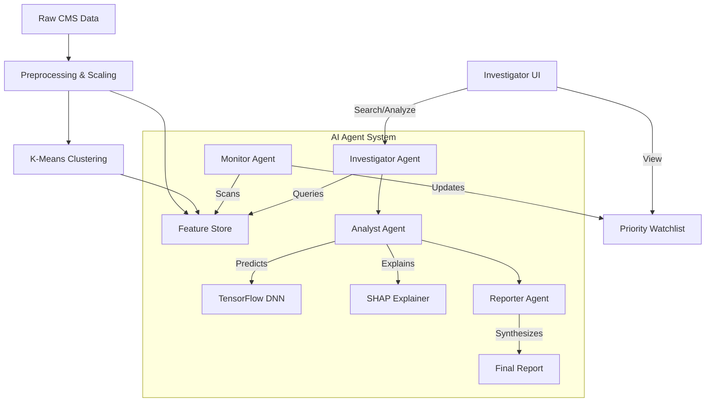

# Healthcare Fraud Detection Algorithm Design

## 1. Overview
This project implements a multi-stage, agentic AI system for detecting healthcare fraud in Medicare Part D Prescriber data. The system combines unsupervised learning (clustering) for anomaly detection, supervised deep learning for risk scoring, and SHAP (SHapley Additive exPlanations) for model explainability.

## 2. Data Pipeline
The pipeline processes raw CMS (Centers for Medicare & Medicaid Services) data to create a feature-rich dataset for modeling.

### 2.1 Data Sources
*   **CMS Medicare Part D Prescriber Data**: Contains detailed information about prescription drugs, costs, and claim counts.
*   **CMS Medicare Part B (Medical Services)**: Contains data on medical procedures and services performed by providers.
*   **LEIE (List of Excluded Individuals/Entities)**: Used to label known fraud cases for training (if available) or validation.

### 2.2 Feature Engineering
Raw data is transformed into meaningful features:
*   **Cost Metrics**: `cost_per_service`, `cost_per_claim`.
*   **Volume Metrics**: `services_per_bene` (Services per Beneficiary), `claims_per_bene`.
*   **Network Metrics**: `pagerank_centrality` (derived from referral networks if graph data is available, otherwise simulated or pre-calculated).
*   **Specialty Normalization**: Features are often normalized by specialty (e.g., `spb_z_tanh`) to account for varying practice patterns across medical fields (e.g., a cardiologist has different cost profiles than a general practitioner).

### 2.3 Preprocessing
*   **Scaling**: `StandardScaler` or `MinMaxScaler` is used to normalize numerical inputs for the neural network.
*   **Imputation**: Missing values are handled (e.g., filling with 0 or median).

## 3. Unsupervised Learning: Archetype Clustering
Before risk scoring, providers are clustered into "Archetypes" using **K-Means Clustering**.

*   **Purpose**: To identify common practice patterns and detect outliers that don't fit standard profiles.
*   **Features Used**: `cost_per_service`, `services_per_bene`, `total_claims`, etc.
*   **Clusters (Archetypes)**:
    *   *Routine Care*: Average cost and volume.
    *   *High-Value Specialist*: High cost, low volume.
    *   *High-Volume Prescriber*: Low cost, high volume.
    *   *Outlier/Anomalous*: Extreme values in one or more dimensions.
*   **Output**: One-hot encoded cluster assignments are fed as features into the supervised model.

## 4. Supervised Learning: Fraud Risk Model
The core detection engine is a **Deep Neural Network (DNN)** built with TensorFlow/Keras.

### 4.1 Architecture
*   **Input Layer**: Accepts ~20-30 features (raw metrics + cluster assignments).
*   **Hidden Layers**:
    *   Dense Layer (64 units, ReLU activation) + Dropout (0.3)
    *   Dense Layer (32 units, ReLU activation) + Dropout (0.2)
    *   Dense Layer (16 units, ReLU activation)
*   **Output Layer**: Single unit with `Sigmoid` activation (outputs probability 0.0 - 1.0).

### 4.2 Training
*   **Loss Function**: Binary Cross-Entropy.
*   **Optimizer**: Adam.
*   **Labels**: Derived from LEIE exclusions (1 = Fraud, 0 = Normal). *Note: In the absence of labeled fraud data, this component may be trained as an autoencoder for anomaly detection (reconstruction error = risk score).*

## 5. Explainability: SHAP (SHapley Additive exPlanations)
To make the "black box" neural network transparent, we use SHAP.

*   **KernelExplainer**: Approximates SHAP values for the deep learning model.
*   **Global Interpretability**: Which features drive fraud risk generally? (e.g., "Cost Per Service" is usually the top factor).
*   **Local Interpretability**: Why is *this specific provider* flagged? (e.g., "Dr. Smith's risk is high *because* his service volume is 3 std devs above average").

## 6. Agentic Workflow
The system is orchestrated by AI Agents (using LLMs like Gemini):

1.  **Investigator Agent**:
    *   **Role**: First-pass filter.
    *   **Action**: Checks raw data against heuristics (rules-based).
    *   **Output**: "Pass" or "Flag for Analysis".

2.  **Analyst Agent**:
    *   **Role**: Deep dive.
    *   **Action**: Runs the TensorFlow model and SHAP explainer.
    *   **Output**: Risk Score (0-1) and Feature Contribution Map.

3.  **Reporter Agent**:
    *   **Role**: Communication.
    *   **Action**: Synthesizes technical outputs into a human-readable narrative.
    *   **Output**: Final investigation report.

4.  **Monitor Agent**:
    *   **Role**: Continuous surveillance.
    *   **Action**: Scans the entire provider database in the background, updating the "Watchlist" with high-risk findings.

## 7. System Architecture Diagram

