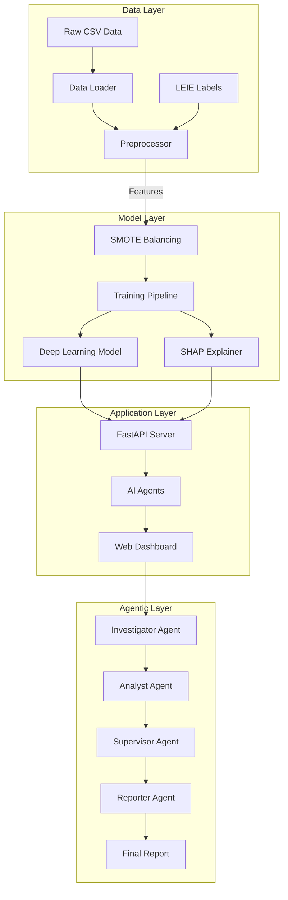
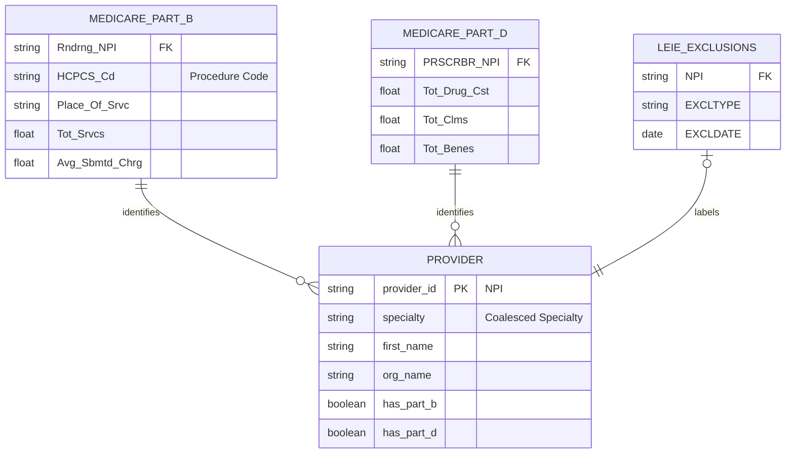

# System Architecture

## 1. High-Level Overview

FraudGuard is designed as a modular, multi-agent system. It separates data processing, model training, and the user-facing application into distinct layers.

## 2. Data Entity-Relationship (ER) Diagram

The system integrates three primary datasets using the **National Provider Identifier (NPI)** as the primary key.

## 3. Component Details

### 3.1 Data Processing
- **Loader:** Handles CSV ingestion and encoding issues.
- **Preprocessor:** Performs outer joins, coalesces missing data, and generates advanced features (PageRank, Archetypes).

### 3.2 AI Agents
- **Investigator:** Rule-based checks (e.g., cost thresholds).
- **Analyst:** Runs the Deep Learning model and interprets SHAP values.
- **Supervisor:** Reviews findings and makes payment decisions (Stop/Hold/Release).
- **Reporter:** Synthesizes findings into human-readable HTML reports using LLMs.
- **Monitor:** Background task that scans the database for new anomalies.

### 3.3 Backend API
- **FastAPI:** Provides REST endpoints for the UI and MCP server.
- **Authentication:** Session-based login with secure cookie handling.

### 3.4 MCP Server
- Exposes internal tools (`predict_fraud`, `explain_fraud`) to external AI assistants via the Model Context Protocol.
