# FraudGuard - System Architecture & Diagrams

## Table of Contents
1. [High-Level Architecture](#1-high-level-architecture)
2. [System Architecture](#2-system-architecture)
3. [Component Interaction](#3-component-interaction)
4. [Data Model Diagrams](#4-data-model-diagrams)
5. [Multi-Agent Flow](#5-multi-agent-flow)
6. [ML Pipeline](#6-ml-pipeline)
7. [CI/CD Pipeline](#7-cicd-pipeline)
8. [Deployment Architecture](#8-deployment-architecture)

---

## 1. High-Level Architecture

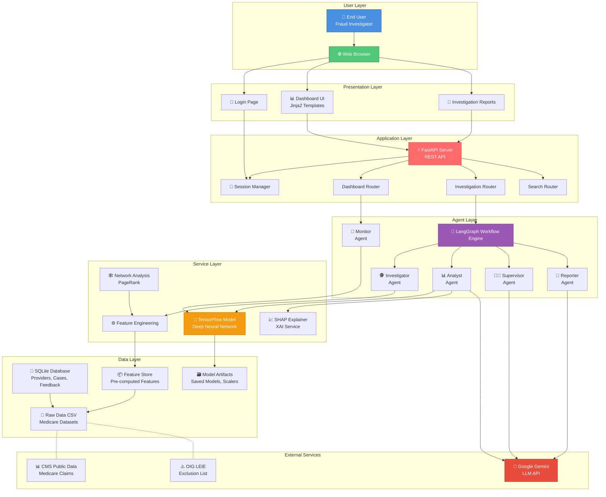

---

## 2. System Architecture

### 2.1 Detailed System Architecture Diagram

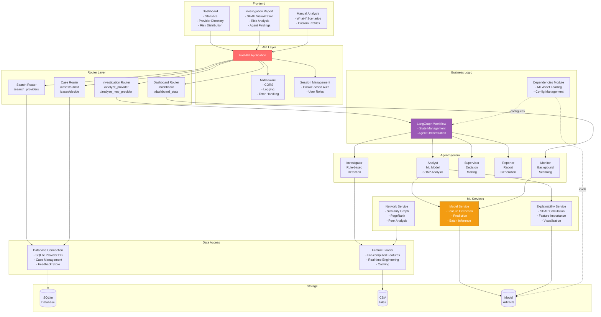

### 2.2 Request Flow Diagram

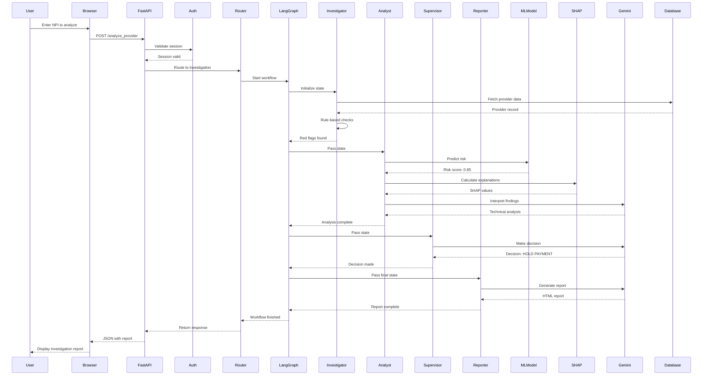

---

## 3. Component Interaction

### 3.1 Component Dependency Graph

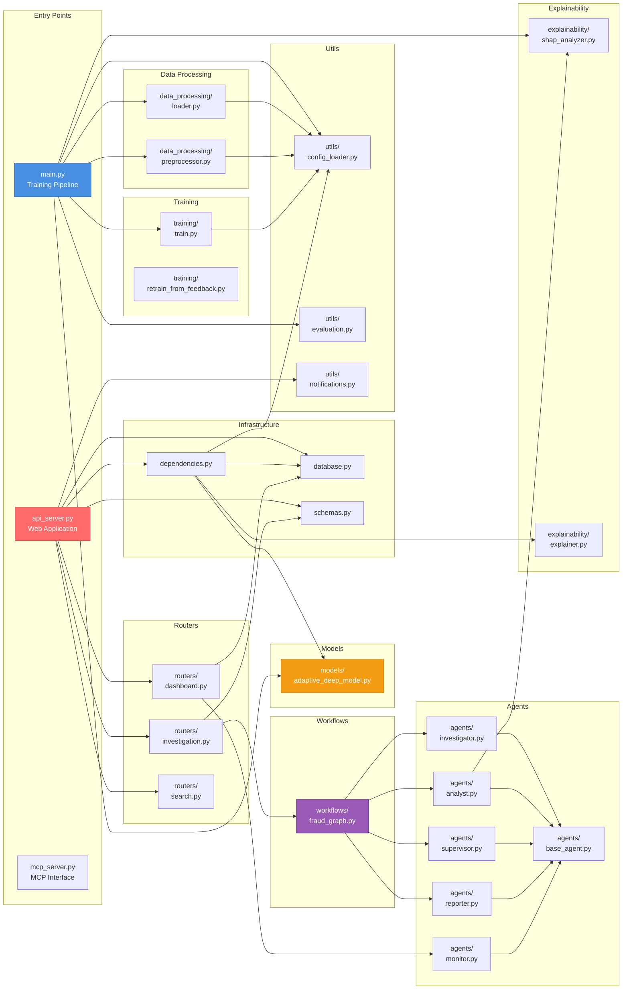

---

## 4. Data Model Diagrams

### 4.1 ER Diagram - Physician Dataset

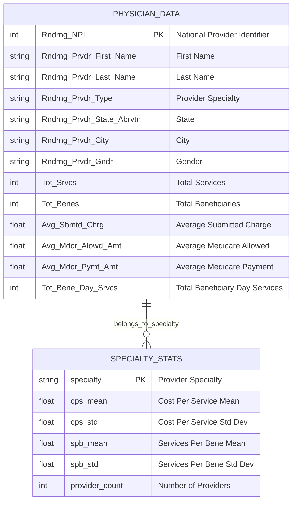

### 4.2 ER Diagram - Prescriber Dataset

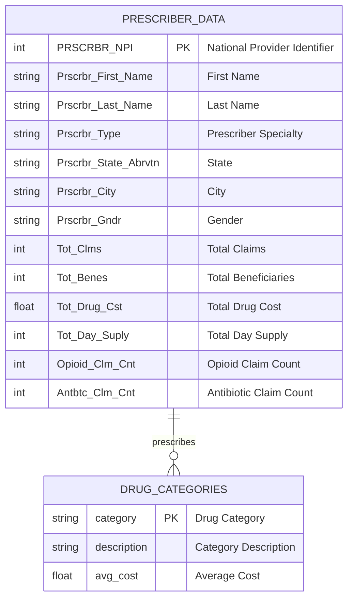

### 4.3 ER Diagram - LEIE Dataset

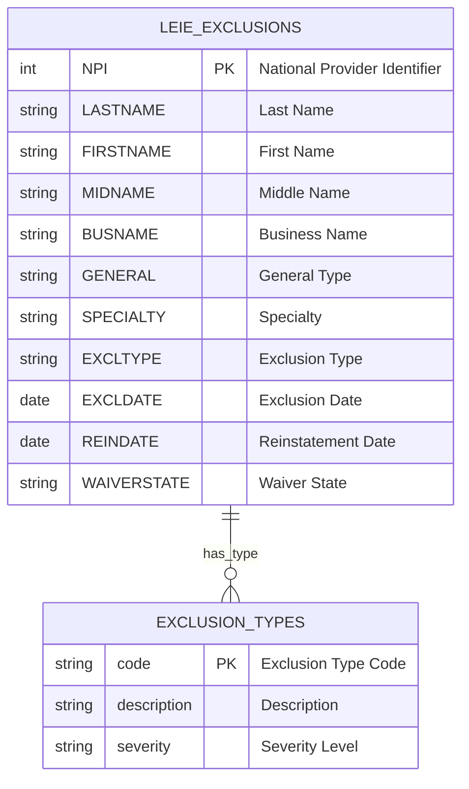

### 4.4 Application Database Schema

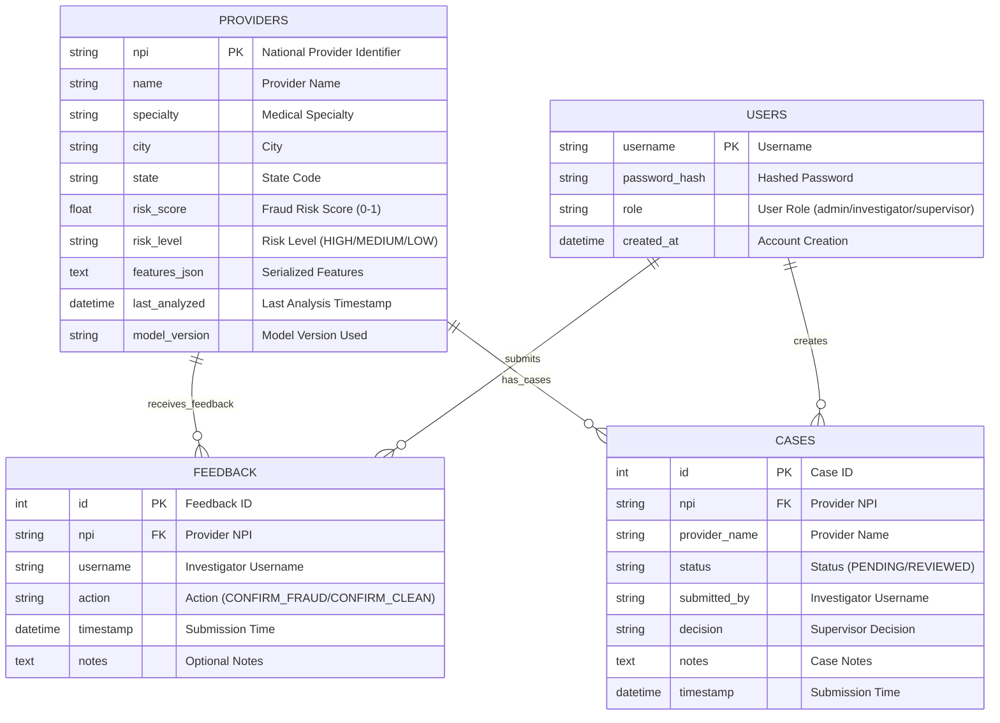

### 4.5 Feature Engineering Data Flow

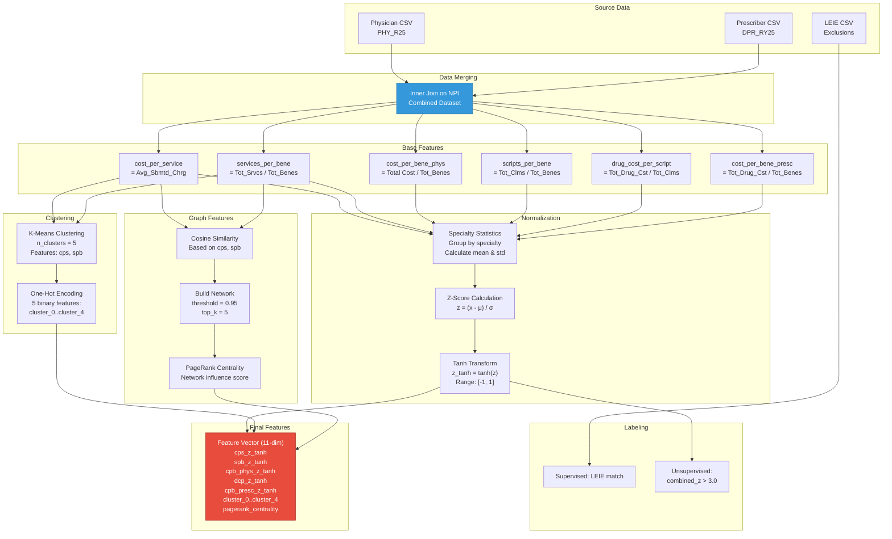

---

## 5. Multi-Agent Flow

### 5.1 LangGraph Workflow Diagram

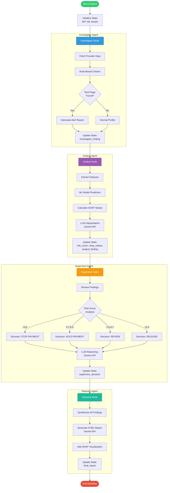

### 5.2 Agent State Transitions

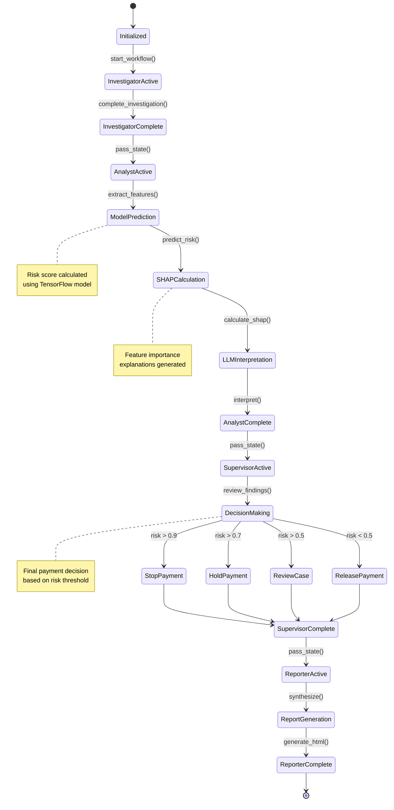

### 5.3 Individual Agent Flows

#### Investigator Agent Flow

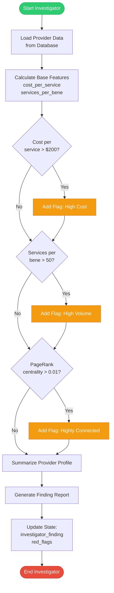

#### Analyst Agent Flow

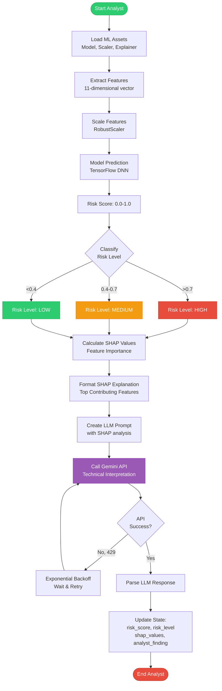

#### Supervisor Agent Flow

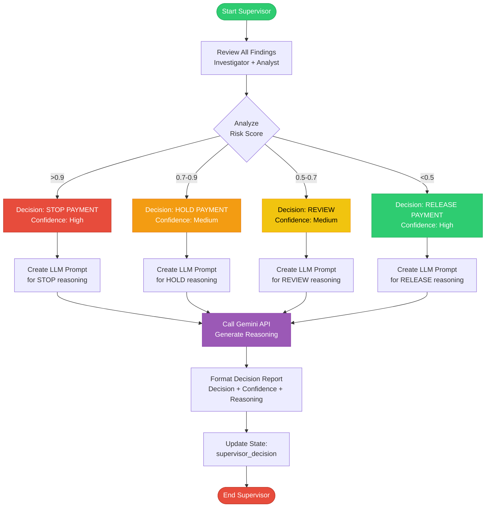

#### Reporter Agent Flow

```mermaid
flowchart TD
    START([Start Reporter]) --> GATHER[Gather All State Data<br/>Investigator, Analyst, Supervisor]
    
    GATHER --> SYNTH[Synthesize Findings<br/>Combine all reports]
    
    SYNTH --> CREATE_PROMPT[Create Reporter Prompt<br/>Structured template]
    CREATE_PROMPT --> SECTIONS[Define Report Sections<br/>- Executive Summary<br/>- Risk Profile<br/>- Model Insights<br/>- Recommendations]
    
    SECTIONS --> CALL_LLM[Call Gemini API<br/>Generate HTML Report]
    
    CALL_LLM --> PARSE_HTML[Parse HTML Response]
    
    PARSE_HTML --> ADD_SHAP[Add SHAP Visualization<br/>Waterfall Chart]
    ADD_SHAP --> ADD_FEATURES[Add Raw Feature Data<br/>Table with metrics]
    ADD_FEATURES --> ADD_STYLE[Add CSS Styling<br/>Professional formatting]
    
    ADD_STYLE --> VALIDATE[Validate HTML<br/>Ensure completeness]
    
    VALIDATE --> UPDATE[Update State:<br/>final_report (HTML)]
    UPDATE --> END([End Reporter])
    
    style START fill:#2ECC71,stroke:#27AE60,color:#fff
    style END fill:#E74C3C,stroke:#C0392B,color:#fff
    style CALL_LLM fill:#9B59B6,stroke:#8E44AD,color:#fff
    style ADD_SHAP fill:#3498DB,stroke:#2980B9,color:#fff
```

#### Monitor Agent Flow

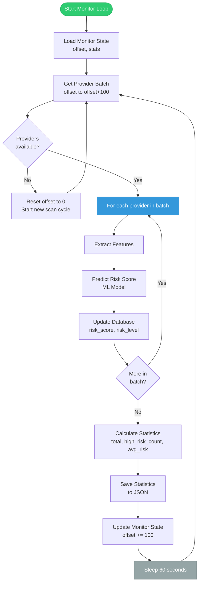

(Continue in next message due to length...)
