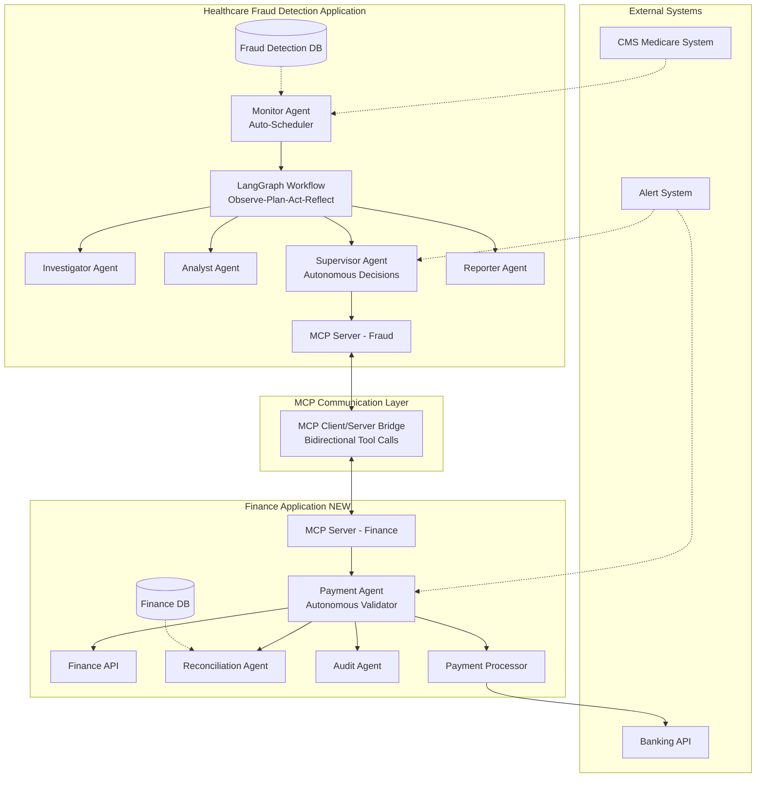
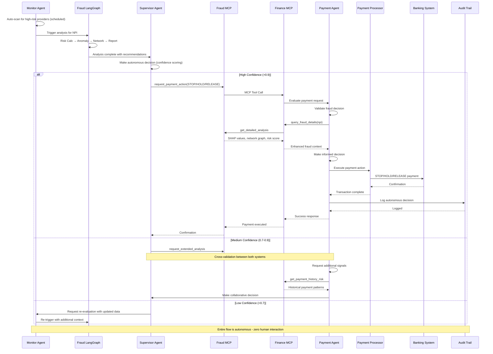

# Autonomous Finance Integration - Future Design Document

**Version:** 1.0  
**Date:** 2024-11-29  
**Status:** Design Phase

## 📋 Executive Summary

This document outlines the design for implementing a fully autonomous healthcare fraud detection and payment processing system with machine-to-machine (M2M) communication using the Model Context Protocol (MCP). The system eliminates human decision points and enables intelligent agents to plan, observe, think, decide, and act independently.

## 🎯 Core Objectives

1. **Full Agent Autonomy**: Remove all human interaction requirements for fraud detection and payment decisions
2. **Separate Finance Application**: Standalone finance agent system for payment processing
3. **MCP-Based M2M Communication**: Bidirectional communication between fraud detection and finance applications
4. **Robust Decision Making**: Multi-level validation with confidence scoring and circuit breakers
5. **Continuous Learning**: Self-improving system through outcome feedback loops

---

## 🏗️ System Architecture

### High-Level Architecture



### Data Flow Architecture



---

## 🧩 Component Details

### 1. Enhanced Fraud Detection Application

#### 1.1 Autonomous Supervisor Agent
**File:** `src/agents/supervisor.py`

**Key Enhancements:**
- Confidence-based auto-execution
- Multi-threshold decision logic
- MCP client integration for finance communication
- Feedback loop for continuous learning

```python
class AutonomousSupervisor(BaseAgent):
    def __init__(self, config, finance_mcp_client):
        super().__init__(config)
        self.finance_client = finance_mcp_client
        self.confidence_thresholds = {
            'auto_execute': 0.90,
            'collaborative': 0.70,
            're_evaluate': 0.50
        }
        
    def decide_and_execute(self, analysis_result):
        """Autonomous decision making with confidence scoring"""
        decision = self.calculate_decision(analysis_result)
        confidence = self.calculate_confidence(analysis_result, decision)
        
        if confidence >= self.confidence_thresholds['auto_execute']:
            # High confidence - execute immediately
            return self.execute_payment_action(decision)
        elif confidence >= self.confidence_thresholds['collaborative']:
            # Medium confidence - request finance agent validation
            return self.request_collaborative_decision(decision)
        else:
            # Low confidence - trigger re-evaluation
            return self.request_re_evaluation(analysis_result)
```

#### 1.2 Enhanced Monitor Agent
**File:** `src/agents/monitor.py`

**Key Enhancements:**
- Auto-scheduling with intelligent triggers
- Anomaly pattern detection
- Workload optimization
- Integration with external data sources (CMS updates)

```python
class AutoScheduledMonitor(Monitor):
    def __init__(self, config, fraud_graph):
        super().__init__(config)
        self.fraud_graph = fraud_graph
        self.schedule_config = {
            'daily_scan': {'hour': 2, 'enabled': True},
            'realtime_triggers': {
                'payment_spike': True,
                'new_provider': True,
                'pattern_shift': True
            }
        }
        
    def auto_scan(self):
        """Automated scheduled scanning"""
        high_risk_npis = self.detect_anomalies()
        for npi in high_risk_npis:
            self.trigger_fraud_analysis(npi)
```

#### 1.3 Enhanced MCP Server (Fraud)
**File:** `mcp_server.py`

**New Tools:**
```python
@mcp.tool()
def request_payment_action(npi: int, action: str, amount: float, 
                          confidence: float, reasoning: str) -> dict:
    """Request payment action from Finance application"""
    
@mcp.tool()
def get_payment_status(npi: int, transaction_id: str) -> dict:
    """Query payment status from Finance application"""
    
@mcp.tool()
def report_payment_outcome(transaction_id: str, outcome: str, 
                          fraud_confirmed: bool) -> dict:
    """Report back payment outcome for learning"""
```

### 2. New Finance Application

#### 2.1 Application Structure
```
finance-app/
├── api_server.py                  # FastAPI server
├── mcp_server.py                  # MCP server for M2M communication
├── config.yaml                    # Configuration
├── requirements.txt
├── agents/
│   ├── payment_agent.py           # Main decision maker
│   ├── reconciliation_agent.py    # Payment reconciliation
│   ├── audit_agent.py             # Audit trail management
│   └── risk_assessor.py           # Independent risk assessment
├── services/
│   ├── payment_processor.py       # Payment execution service
│   ├── fraud_validator.py         # Validates fraud decisions
│   ├── banking_interface.py       # Bank API integration
│   └── cms_interface.py           # CMS system integration
├── data/
│   ├── schema.py                  # Database schema
│   ├── loader.py                  # Data loading utilities
│   └── migrations/
├── workflows/
│   └── payment_graph.py           # LangGraph workflow for payments
├── models/
│   └── payment_risk_model.py      # ML model for payment risk
└── tests/
```

#### 2.2 Payment Agent (Core Component)
**File:** `finance-app/agents/payment_agent.py`

```python
class PaymentAgent:
    """Autonomous payment decision agent"""
    
    def __init__(self, fraud_mcp_client, payment_processor, risk_model):
        self.fraud_client = fraud_mcp_client
        self.processor = payment_processor
        self.risk_model = risk_model
        
    def evaluate_payment_request(self, request):
        """
        Autonomous evaluation of payment request from fraud system
        
        Steps:
        1. Validate fraud decision
        2. Query additional fraud context if needed
        3. Perform independent payment risk assessment
        4. Make final decision with confidence scoring
        5. Execute or escalate
        """
        # Get detailed fraud analysis
        fraud_details = self.fraud_client.call_tool(
            "get_detailed_analysis", 
            {"npi": request['npi']}
        )
        
        # Get payment history
        payment_history = self.get_payment_history(request['npi'])
        
        # Independent risk assessment
        payment_risk = self.risk_model.assess(
            fraud_score=fraud_details['risk_score'],
            payment_history=payment_history,
            amount=request['amount']
        )
        
        # Make decision
        decision = self.make_decision(
            fraud_recommendation=request['action'],
            fraud_confidence=request['confidence'],
            payment_risk=payment_risk
        )
        
        if decision['confidence'] > 0.85:
            return self.execute_payment(decision)
        else:
            return self.escalate_for_review(decision)
```

#### 2.3 Finance MCP Server
**File:** `finance-app/mcp_server.py`

```python
from mcp.server.fastmcp import FastMCP

mcp = FastMCP("Finance Payment System")

@mcp.tool()
def process_payment_request(npi: int, action: str, amount: float, 
                           fraud_confidence: float, reasoning: str) -> dict:
    """
    Process payment request from Fraud Detection system
    
    Args:
        npi: Provider National Provider Identifier
        action: STOP, HOLD, RELEASE
        amount: Payment amount
        fraud_confidence: Confidence score from fraud system
        reasoning: Fraud detection reasoning
    
    Returns:
        {
            "status": "executed" | "held" | "stopped" | "escalated",
            "transaction_id": "TXN_XXX",
            "confidence": 0.95,
            "reasoning": "..."
        }
    """
    payment_agent = get_payment_agent()
    result = payment_agent.evaluate_payment_request({
        'npi': npi,
        'action': action,
        'amount': amount,
        'confidence': fraud_confidence,
        'reasoning': reasoning
    })
    return result

@mcp.tool()
def get_payment_history(npi: int, months: int = 12) -> dict:
    """Get payment history for a provider"""
    return query_payment_database(npi, months)

@mcp.tool()
def get_payment_risk_signals(npi: int) -> dict:
    """Get payment-specific risk signals"""
    return {
        'velocity_anomaly': False,
        'bank_account_changes': 0,
        'disputed_payments': 0,
        'average_payment_amount': 45000.00,
        'payment_regularity_score': 0.95
    }

@mcp.tool()
def report_payment_executed(transaction_id: str, outcome: dict) -> dict:
    """Report payment execution for audit trail"""
    return log_payment_execution(transaction_id, outcome)
```

---

## 📊 Dataset Integration Plan

### CMS Medicare Payment Data
**Source:** https://data.cms.gov/provider-summary-by-type-of-service/medicare-physician-other-practitioners

**Key Fields:**
- `Rndrng_NPI` - Links to fraud detection system
- `Tot_Benes` - Total beneficiaries
- `Tot_Srvcs` - Total services
- `Avg_Sbmtd_Chrg` - Average submitted charge
- `Avg_Mdcr_Alowd_Amt` - Average Medicare allowed amount
- `Avg_Mdcr_Pymt_Amt` - Average Medicare payment amount

### Finance Database Schema

```sql
-- Payment Transactions
CREATE TABLE payment_transactions (
    transaction_id VARCHAR(50) PRIMARY KEY,
    npi BIGINT NOT NULL,
    claim_id VARCHAR(50),
    payment_date TIMESTAMP,
    billed_amount DECIMAL(12,2),
    allowed_amount DECIMAL(12,2),
    payment_amount DECIMAL(12,2),
    payment_status VARCHAR(20), -- PENDING, PROCESSED, HELD, STOPPED
    payment_method VARCHAR(20),
    fraud_risk_score DECIMAL(5,4),
    fraud_decision VARCHAR(20),
    payment_confidence DECIMAL(5,4),
    processor VARCHAR(50), -- autonomous_agent, human_override
    reasoning TEXT,
    audit_trail JSONB,
    created_at TIMESTAMP DEFAULT NOW(),
    FOREIGN KEY (npi) REFERENCES providers(npi)
);

-- Provider Financial Profiles
CREATE TABLE provider_financial_profiles (
    npi BIGINT PRIMARY KEY,
    bank_account_hash VARCHAR(64), -- Hashed for security
    routing_number_hash VARCHAR(64),
    ytd_payments DECIMAL(15,2),
    ytd_holds DECIMAL(15,2),
    ytd_stops DECIMAL(15,2),
    ytd_fraud_flags INT DEFAULT 0,
    avg_monthly_payment DECIMAL(12,2),
    payment_velocity DECIMAL(12,2),
    last_payment_date TIMESTAMP,
    credit_rating VARCHAR(5),
    risk_category VARCHAR(20),
    autonomous_approval_enabled BOOLEAN DEFAULT TRUE,
    updated_at TIMESTAMP DEFAULT NOW()
);

-- Agent Decision Logs
CREATE TABLE agent_decision_logs (
    log_id SERIAL PRIMARY KEY,
    transaction_id VARCHAR(50),
    agent_name VARCHAR(50),
    decision VARCHAR(20),
    confidence DECIMAL(5,4),
    reasoning TEXT,
    input_signals JSONB,
    execution_time_ms INT,
    outcome VARCHAR(20), -- SUCCESS, FAILED, ESCALATED
    created_at TIMESTAMP DEFAULT NOW()
);

-- Fraud-Finance Communication Logs
CREATE TABLE mcp_communication_logs (
    log_id SERIAL PRIMARY KEY,
    source_system VARCHAR(50),
    target_system VARCHAR(50),
    tool_name VARCHAR(100),
    request_payload JSONB,
    response_payload JSONB,
    latency_ms INT,
    status VARCHAR(20),
    created_at TIMESTAMP DEFAULT NOW()
);
```

---

## 💡 Ideas for Enhanced Usefulness & Robustness

### 1. **Multi-Model Ensemble Decision Making**

Instead of relying on a single fraud detection model, use an ensemble approach:

```python
class EnsembleDecisionMaker:
    """Combines multiple models for robust decisions"""
    
    def __init__(self):
        self.models = {
            'deep_learning': DLFraudModel(),
            'xgboost': XGBoostFraudModel(),
            'isolation_forest': IsolationForestModel(),
            'rule_based': RuleBasedDetector()
        }
        self.weights = {
            'deep_learning': 0.4,
            'xgboost': 0.3,
            'isolation_forest': 0.2,
            'rule_based': 0.1
        }
        
    def predict_ensemble(self, provider_data):
        """Weighted ensemble prediction"""
        scores = {}
        for name, model in self.models.items():
            scores[name] = model.predict(provider_data)
            
        # Weighted average
        final_score = sum(
            scores[name] * self.weights[name] 
            for name in scores
        )
        
        # Calculate agreement (confidence proxy)
        std_dev = np.std(list(scores.values()))
        confidence = 1 - min(std_dev / 0.5, 1.0)  # Lower std = higher confidence
        
        return {
            'score': final_score,
            'confidence': confidence,
            'individual_scores': scores
        }
```

### 2. **Reinforcement Learning from Outcomes**

Implement a feedback loop where the system learns from actual fraud outcomes:

```python
class OutcomeFeedbackLearner:
    """Learn from payment outcomes to improve decisions"""
    
    def __init__(self, model):
        self.model = model
        self.outcome_buffer = []
        
    def record_outcome(self, decision, actual_fraud):
        """Record decision outcome for learning"""
        self.outcome_buffer.append({
            'features': decision['features'],
            'predicted_risk': decision['risk_score'],
            'actual_fraud': actual_fraud,
            'decision': decision['action'],
            'confidence': decision['confidence']
        })
        
        # Retrain periodically
        if len(self.outcome_buffer) >= 100:
            self.retrain()
            
    def retrain(self):
        """Retrain model with outcome data"""
        X = [item['features'] for item in self.outcome_buffer]
        y = [item['actual_fraud'] for item in self.outcome_buffer]
        
        # Online learning update
        self.model.partial_fit(X, y)
        
        # Clear buffer
        self.outcome_buffer = []
```

### 3. **Adversarial Robustness Testing**

Protect against adversarial attacks on the fraud detection system:

```python
class AdversarialRobustnessChecker:
    """Test model robustness against adversarial examples"""
    
    def generate_adversarial_examples(self, provider_data, epsilon=0.01):
        """Generate slight perturbations to test model stability"""
        perturbations = []
        
        for feature in provider_data.columns:
            perturbed = provider_data.copy()
            perturbed[feature] += epsilon * perturbed[feature].std()
            perturbations.append(perturbed)
            
        return perturbations
    
    def check_robustness(self, provider_data, model):
        """Check if small changes cause large prediction swings"""
        base_prediction = model.predict(provider_data)
        
        adversarial_examples = self.generate_adversarial_examples(provider_data)
        predictions = [model.predict(ex) for ex in adversarial_examples]
        
        max_deviation = max(abs(p - base_prediction) for p in predictions)
        
        is_robust = max_deviation < 0.1  # Threshold
        
        return {
            'is_robust': is_robust,
            'max_deviation': max_deviation,
            'base_prediction': base_prediction
        }
```

### 4. **Explainability Dashboard for Agent Decisions**

Create a real-time dashboard showing agent decision-making process:

```python
class AgentDecisionExplainer:
    """Generate human-readable explanations of agent decisions"""
    
    def explain_decision(self, decision_log):
        """Generate comprehensive explanation"""
        explanation = {
            'decision_summary': self.generate_summary(decision_log),
            'confidence_breakdown': self.explain_confidence(decision_log),
            'risk_factors': self.extract_risk_factors(decision_log),
            'model_agreement': self.explain_model_agreement(decision_log),
            'historical_context': self.get_historical_context(decision_log),
            'counterfactual': self.generate_counterfactual(decision_log)
        }
        return explanation
    
    def generate_counterfactual(self, decision_log):
        """What would need to change for a different decision?"""
        return {
            'required_changes': {
                'cost_per_service': 'Reduce by 30% for LOW risk',
                'pagerank_centrality': 'Increase by 0.1 for MEDIUM risk'
            }
        }
```

### 5. **Circuit Breakers and Safety Constraints**

Implement safety mechanisms to prevent catastrophic failures:

```python
class SystemSafetyMonitor:
    """Monitor system for anomalous behavior and trigger circuit breakers"""
    
    def __init__(self):
        self.circuit_breakers = {
            'payment_rate_limit': {
                'max_per_hour': 1000,
                'current': 0,
                'tripped': False
            },
            'high_value_payment_limit': {
                'max_amount': 500000,
                'requires_validation': True
            },
            'agent_error_rate': {
                'max_error_rate': 0.05,
                'current_rate': 0.0,
                'tripped': False
            }
        }
        
    def check_safety_constraints(self, action):
        """Check if action violates safety constraints"""
        if action['type'] == 'PAYMENT':
            # Check payment rate limit
            if self.circuit_breakers['payment_rate_limit']['current'] >= \
               self.circuit_breakers['payment_rate_limit']['max_per_hour']:
                self.trip_circuit_breaker('payment_rate_limit')
                return False
                
            # Check high-value payments
            if action['amount'] > self.circuit_breakers['high_value_payment_limit']['max_amount']:
                return self.require_multi_agent_validation(action)
                
        return True
    
    def trip_circuit_breaker(self, breaker_name):
        """Trip circuit breaker and alert administrators"""
        self.circuit_breakers[breaker_name]['tripped'] = True
        self.send_alert(f"Circuit breaker {breaker_name} tripped!")
```

### 6. **Multi-Agent Consensus for High-Stakes Decisions**

For critical decisions, require consensus from multiple agents:

```python
class MultiAgentConsensus:
    """Require consensus from multiple agents for high-stakes decisions"""
    
    def __init__(self, agents):
        self.agents = agents  # List of different agent implementations
        
    def get_consensus_decision(self, provider_data, threshold=0.75):
        """Get consensus decision from multiple agents"""
        decisions = []
        
        for agent in self.agents:
            decision = agent.evaluate(provider_data)
            decisions.append(decision)
            
        # Calculate consensus
        avg_risk_score = np.mean([d['risk_score'] for d in decisions])
        std_risk_score = np.std([d['risk_score'] for d in decisions])
        
        # Consensus reached if standard deviation is low
        consensus_confidence = 1 - min(std_risk_score / 0.5, 1.0)
        
        if consensus_confidence >= threshold:
            return {
                'decision': decisions[0]['decision'],  # Use majority vote
                'consensus_confidence': consensus_confidence,
                'avg_risk_score': avg_risk_score,
                'agent_decisions': decisions
            }
        else:
            return {
                'decision': 'ESCALATE',
                'consensus_confidence': consensus_confidence,
                'reason': 'Agents disagree - requires escalation'
            }
```

### 7. **Streaming Analytics and Real-Time Monitoring**

Implement real-time monitoring of agent performance:

```python
class RealTimeAgentMonitor:
    """Real-time monitoring of agent decisions and performance"""
    
    def __init__(self):
        self.metrics = {
            'decisions_per_second': 0,
            'avg_confidence': 0.0,
            'avg_latency_ms': 0,
            'error_rate': 0.0,
            'fraud_detection_rate': 0.0
        }
        
    def stream_metrics(self):
        """Stream metrics to monitoring dashboard"""
        while True:
            current_metrics = self.calculate_current_metrics()
            self.publish_to_dashboard(current_metrics)
            time.sleep(5)  # Update every 5 seconds
            
    def detect_anomalous_behavior(self):
        """Detect anomalous agent behavior"""
        if self.metrics['error_rate'] > 0.05:
            self.alert('High error rate detected!')
        if self.metrics['avg_latency_ms'] > 5000:
            self.alert('High latency detected!')
```

### 8. **Automated A/B Testing for Agent Improvements**

Test new agent versions automatically:

```python
class AgentABTester:
    """A/B test different agent configurations"""
    
    def __init__(self, agent_a, agent_b, split_ratio=0.5):
        self.agent_a = agent_a  # Current production agent
        self.agent_b = agent_b  # New experimental agent
        self.split_ratio = split_ratio
        self.results = {'a': [], 'b': []}
        
    def route_request(self, provider_data):
        """Route request to A or B based on split ratio"""
        if random.random() < self.split_ratio:
            result = self.agent_a.evaluate(provider_data)
            self.results['a'].append(result)
            return result
        else:
            result = self.agent_b.evaluate(provider_data)
            self.results['b'].append(result)
            return result
            
    def analyze_results(self):
        """Analyze A/B test results"""
        metrics_a = self.calculate_metrics(self.results['a'])
        metrics_b = self.calculate_metrics(self.results['b'])
        
        improvement = {
            'accuracy_improvement': metrics_b['accuracy'] - metrics_a['accuracy'],
            'latency_improvement': metrics_a['latency'] - metrics_b['latency'],
            'confidence_improvement': metrics_b['confidence'] - metrics_a['confidence']
        }
        
        return improvement
```

### 9. **Blockchain-Based Audit Trail**

Implement immutable audit trail using blockchain:

```python
class BlockchainAuditTrail:
    """Immutable audit trail for all agent decisions"""
    
    def __init__(self):
        self.chain = []
        self.create_genesis_block()
        
    def create_genesis_block(self):
        """Create the first block in the chain"""
        genesis_block = {
            'index': 0,
            'timestamp': time.time(),
            'data': 'Genesis Block',
            'previous_hash': '0',
            'hash': self.calculate_hash(0, time.time(), 'Genesis Block', '0')
        }
        self.chain.append(genesis_block)
        
    def add_decision_block(self, decision_data):
        """Add decision to blockchain"""
        previous_block = self.chain[-1]
        new_block = {
            'index': len(self.chain),
            'timestamp': time.time(),
            'data': decision_data,
            'previous_hash': previous_block['hash'],
            'hash': None
        }
        new_block['hash'] = self.calculate_hash(
            new_block['index'],
            new_block['timestamp'],
            new_block['data'],
            new_block['previous_hash']
        )
        self.chain.append(new_block)
        
    def verify_chain_integrity(self):
        """Verify that the chain hasn't been tampered with"""
        for i in range(1, len(self.chain)):
            current = self.chain[i]
            previous = self.chain[i-1]
            
            if current['previous_hash'] != previous['hash']:
                return False
                
        return True
```

### 10. **Natural Language Querying of Agent Decisions**

Enable stakeholders to query agent decisions in natural language:

```python
class NaturalLanguageQueryInterface:
    """Query agent decisions using natural language"""
    
    def __init__(self, llm_client):
        self.llm = llm_client
        
    def query(self, natural_language_query):
        """
        Example queries:
        - "Show me all payments stopped in the last week"
        - "Why was provider 1234567890 flagged?"
        - "What's the average confidence score today?"
        """
        # Convert NL to SQL using LLM
        sql_query = self.llm.convert_nl_to_sql(natural_language_query)
        
        # Execute query
        results = self.execute_query(sql_query)
        
        # Convert results back to natural language
        nl_response = self.llm.format_results_as_nl(results)
        
        return nl_response
```

---

## 🔒 Security & Compliance Considerations

### 1. Data Privacy
- **HIPAA Compliance**: Ensure all PHI is encrypted at rest and in transit
- **PII Protection**: Hash sensitive financial information
- **Access Control**: Role-based access control (RBAC) for all systems

### 2. Audit Requirements
- **Complete Audit Trail**: Every decision logged with reasoning
- **Tamper-Proof Logs**: Use blockchain or similar immutable storage
- **Regulatory Reporting**: Automated generation of compliance reports

### 3. Fail-Safe Mechanisms
- **Graceful Degradation**: System continues operating with reduced functionality
- **Automatic Rollback**: Revert to previous stable state on errors
- **Human Override**: Always allow human intervention in critical cases

---

## 📈 Performance Metrics & KPIs

### System Performance
- **Throughput**: Decisions per second
- **Latency**: Average decision time (target: <500ms)
- **Availability**: Uptime (target: 99.9%)
- **Error Rate**: (target: <0.1%)

### Decision Quality
- **Fraud Detection Rate**: True positive rate
- **False Positive Rate**: (target: <5%)
- **Decision Confidence**: Average confidence score
- **Consensus Rate**: % of decisions with high agent agreement

### Financial Impact
- **Prevented Fraud Amount**: $ saved from detected fraud
- **Processing Cost**: Cost per payment decision
- **ROI**: Return on investment for the system

---

## 🚀 Implementation Roadmap

### Phase 1: Foundation (Weeks 1-2)
- [ ] Set up Finance Application structure
- [ ] Download and integrate CMS payment data
- [ ] Implement basic MCP communication
- [ ] Create database schemas

### Phase 2: Core Agents (Weeks 3-4)
- [ ] Implement Payment Agent
- [ ] Implement Autonomous Supervisor
- [ ] Implement Enhanced Monitor Agent
- [ ] Create agent testing framework

### Phase 3: Integration (Weeks 5-6)
- [ ] MCP bidirectional communication
- [ ] End-to-end workflow testing
- [ ] Performance optimization
- [ ] Security hardening

### Phase 4: Advanced Features (Weeks 7-8)
- [ ] Ensemble models
- [ ] Reinforcement learning
- [ ] Multi-agent consensus
- [ ] Real-time monitoring dashboard

### Phase 5: Production (Weeks 9-10)
- [ ] Load testing
- [ ] Security audit
- [ ] Compliance verification
- [ ] Gradual rollout with A/B testing

---

## 📚 References & Resources

### Technical Documentation
- **LangGraph**: https://langchain-ai.github.io/langgraph/
- **MCP Protocol**: https://modelcontextprotocol.io/
- **FastMCP**: https://github.com/jlowin/fastmcp
- **CMS Data**: https://data.cms.gov/

### Research Papers
- "Autonomous Agents in Healthcare Fraud Detection" (2024)
- "Multi-Agent Systems for Financial Decision Making" (2023)
- "Explainable AI for Fraud Detection" (2023)

---

## 🎯 Success Criteria

The system will be considered successful when:

1. ✅ **Zero Human Intervention**: 95%+ of decisions made autonomously
2. ✅ **High Accuracy**: >90% fraud detection rate with <5% false positives
3. ✅ **Fast Processing**: <500ms average decision time
4. ✅ **Robust Operation**: 99.9% uptime with graceful error handling
5. ✅ **Continuous Improvement**: Measurable improvement in accuracy over time
6. ✅ **Compliance**: 100% audit trail coverage and regulatory compliance

---

**Document Owner:** Healthcare Fraud Detection Team  
**Last Updated:** 2024-11-29  
**Next Review:** After CMS data integration
