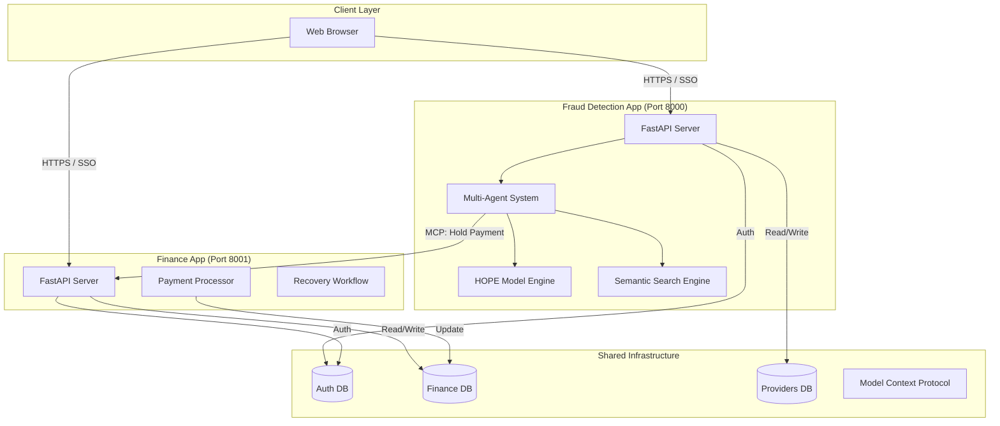
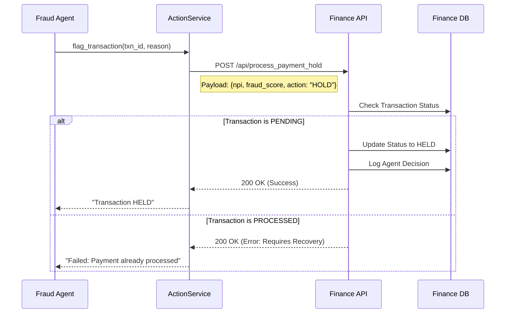
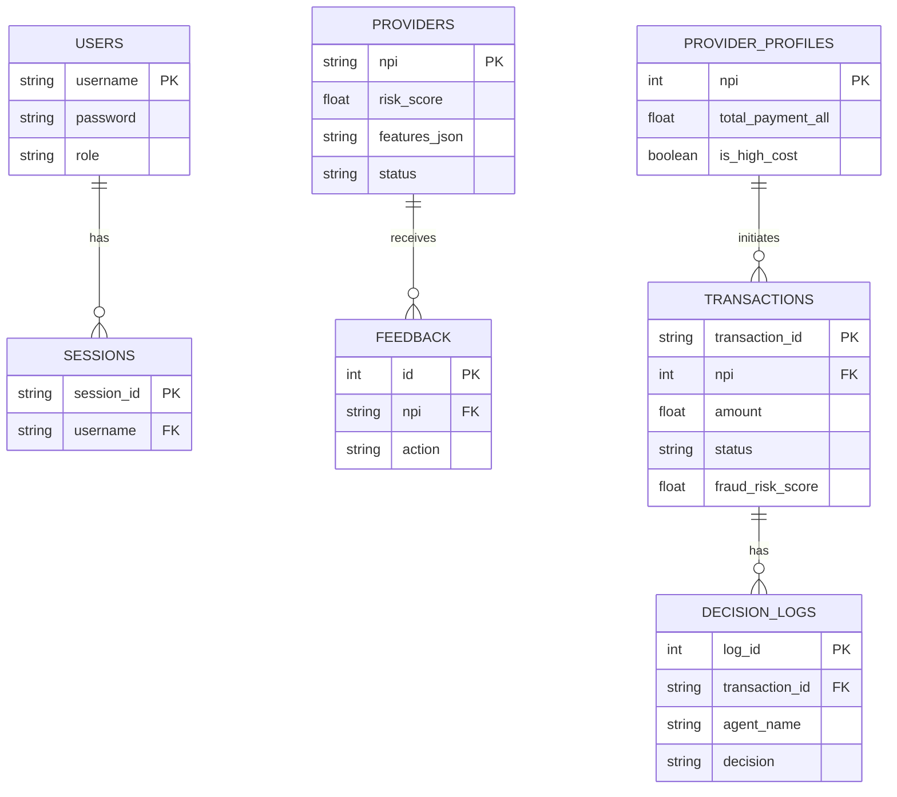

# Comprehensive System Documentation

## 1. Executive Summary

The **Health Care Fraud Detection System** is a dual-application platform designed to identify, investigate, and mitigate healthcare fraud in real-time. It consists of two primary applications:
1.  **Fraud Detection App**: An AI-powered system that ingests provider data, calculates risk scores using deep learning, and employs multi-agent workflows for investigation.
2.  **Finance App**: A transaction processing system that manages payments, handles recovery workflows, and enforces payment holds triggered by the Fraud App.

The system leverages the **HOPE (Hybrid Optimization & Predictive Engine)** architecture, utilizing nested learning models and a Model Context Protocol (MCP) for seamless inter-application communication.

---

## 2. Beginner's Guide: How It Works

If you are new to the system, here is the step-by-step flow of how data moves through the platform:

### Step 1: Data Ingestion
*   **What happens**: A user uploads a CSV file containing provider billing data (e.g., Medicare claims) to the Fraud Detection App.
*   **Behind the scenes**: The system reads the file, cleans the data, and prepares it for analysis.

### Step 2: Feature Engineering & Analysis
*   **What happens**: The system calculates advanced metrics for each provider.
*   **Key Algorithms**:
    *   **K-Means Clustering**: Groups providers into "Archetypes" (e.g., "High Volume Operator" vs. "Routine Care") to spot behavioral patterns.
    *   **Network Analysis**: Builds a graph of providers based on how similar their billing patterns are. It uses **PageRank** to find "central" nodes—providers who behave like many others, which can indicate organized fraud rings.
*   **Result**: Each provider gets a "Feature Vector" (a mathematical profile).

### Step 3: Risk Scoring (HOPE Model)
*   **What happens**: The AI model (HOPE) examines the Feature Vector and assigns a **Fraud Risk Score** from 0.0 (Safe) to 1.0 (High Risk).
*   **Why HOPE?**: It uses a "Fast Model" to learn new fraud trends quickly and a "Slow Model" to remember long-term patterns, ensuring the system doesn't "forget" old tricks while learning new ones.

### Step 4: Automated Investigation (Agents)
*   **What happens**: If a provider's score is high (e.g., > 0.85), the **Investigator Agent** wakes up.
*   **Action**: It reviews the data, asks the **Analyst Agent** for details (using SHAP to explain *why* the score is high), and generates a report.

### Step 5: Action & Finance Integration
*   **What happens**: If the risk is confirmed, the **Supervisor Agent** sends a command to the Finance App.
*   **Action**: The Finance App places a **Payment Hold** on the provider's transactions, preventing money from leaving the system.

---

## 3. System Architecture

### 3.1 High-Level Architecture Diagram

---

## 4. Deep Dive: Algorithms & AI Models

### 4.1 K-Means Clustering (Archetype Detection)
*   **Purpose**: To categorize providers into distinct behavioral groups ("Archetypes") without human labeling.
*   **Implementation**: `src/data_processing/preprocessor.py`
*   **How it works**:
    1.  The system selects key behavioral features: `total_claim_cost`, `services_per_bene`, etc.
    2.  **K-Means** algorithm groups providers into **5 Clusters** (`n_clusters=5`).
    3.  Each provider is assigned a "Cluster ID" (0-4).
    4.  These IDs are One-Hot Encoded (e.g., `[0, 1, 0, 0, 0]`) and fed into the Fraud Prediction Model.
*   **Why it matters**: It helps the model distinguish between a "High Cost Specialist" (legitimate) and a "High Cost Generalist" (suspicious) by comparing them to their peers in the same cluster.

### 4.2 NetworkX & PageRank (Similarity Graph)
*   **Purpose**: To detect "Organized Fraud Rings" or providers who mimic known fraud patterns.
*   **Implementation**: `src/data_processing/preprocessor.py`
*   **How it works**:
    1.  **Graph Construction**:
        *   **Nodes**: Each provider is a node.
        *   **Edges**: An edge is drawn between two providers if they have the same `specialty`.
    2.  **PageRank Centrality**:
        *   The system runs the **PageRank** algorithm on this graph.
        *   **High PageRank**: Indicates a provider is "central" or highly connected within their specialty network.
    3.  **Feature Integration**: The calculated `pagerank_centrality` score is added to the provider's profile.
*   **Interpretation**: In fraud networks, bad actors often share patient lists or billing schemes, making them appear "central" in a similarity graph.

### 4.3 HOPE Architecture (Nested Learning)
*   **Type**: Neural Network with Nested Learning.
*   **Input**: 11-dimensional feature vector (Z-scores, Archetypes, PageRank).
*   **Architecture**:
    *   Input Layer (11 units)
    *   Dense Layer (64 units, PReLU, BatchNormalization, Dropout)
    *   Dense Layer (32 units, PReLU, BatchNormalization, Dropout)
    *   Output Layer (1 unit, Sigmoid)
*   **Optimization**: Adam Optimizer.
*   **Special Feature**: **Dual-Speed Weights (HOPE)**.
    *   `Fast Model`: The "Adaptive" learner. It updates its weights after every batch of data, allowing it to react instantly to new fraud patterns.
    *   `Slow Model`: The "Stable" core memory. It **continuously** absorbs knowledge from the Fast Model after every step using **Exponential Moving Average (EMA)**.
    *   **Knowledge Transfer**: `Slow_Weight = (alpha * Slow_Weight) + ((1-alpha) * Fast_Weight)`. This ensures the Slow Model never stops learning; it simply filters out noise and prevents catastrophic forgetting by smoothing the updates from the Fast Model.

### 4.4 Semantic Search
*   **Model**: `all-MiniLM-L6-v2` (Sentence Transformer).
*   **Process**:
    1.  Generate text description for each provider: *"Cardiology provider. Risk Level: High..."*
    2.  Compute embeddings and store in memory.
    3.  On query, compute Cosine Similarity between query embedding and provider embeddings.
    4.  **Hybrid Filtering**:
        *   Detects intent keywords ("High Risk", "Cardiology").
        *   Filters results based on metadata *after* similarity search.

### 4.5 Explainable AI (XAI)
*   **Library**: SHAP (SHapley Additive exPlanations).
*   **Method**: `KernelExplainer`.
*   **Usage**: Calculates the marginal contribution of each feature to the final risk score, allowing the "Analyst Agent" to explain *why* a provider was flagged.

---

## 5. Integrations & Communications

### 5.1 Model Context Protocol (MCP)
The system uses a simplified MCP implementation to allow the Fraud Detection App to control actions in the Finance App.

**Sequence Diagram: Payment Hold Action**

### 5.2 Single Sign-On (SSO)
Both applications share a common authentication database and session mechanism.

*   **Database**: `shared-data/databases/auth.db`
*   **Mechanism**: HTTP-only cookie (`hcfd_session`) set with `Path=/`.
*   **Flow**:
    1.  User logs in via either app.
    2.  Session ID is generated and stored in `auth.db`.
    3.  Cookie is set for the root domain.
    4.  Middleware in both apps validates the session ID against `auth.db`.

---

## 6. Data Architecture

### 6.1 Database Schema Relationships

All databases are SQLite files located in `shared-data/databases/`.

### 6.2 Database Descriptions
1.  **auth.db**:
    *   `users`: Stores credentials and roles (admin, supervisor).
    *   `sessions`: Active session tokens.
2.  **providers.db**:
    *   `providers`: The "Feature Store" for the Fraud App. Contains risk scores and engineered features.
3.  **finance.db**:
    *   `provider_financial_profiles`: Aggregated financial metrics (Total Payments, High Cost flags).
    *   `payment_transactions`: Individual transaction records.
    *   `agent_decision_logs`: Audit trail of AI decisions.
4.  **cases.db**:
    *   `cases`: Workflow data for manual supervisor reviews.
5.  **feedback.db**:
    *   `feedback`: Human-in-the-loop feedback for Reinforcement Learning (RL).
