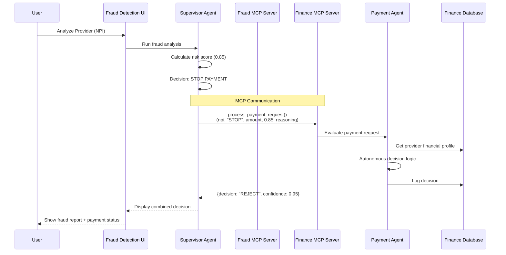
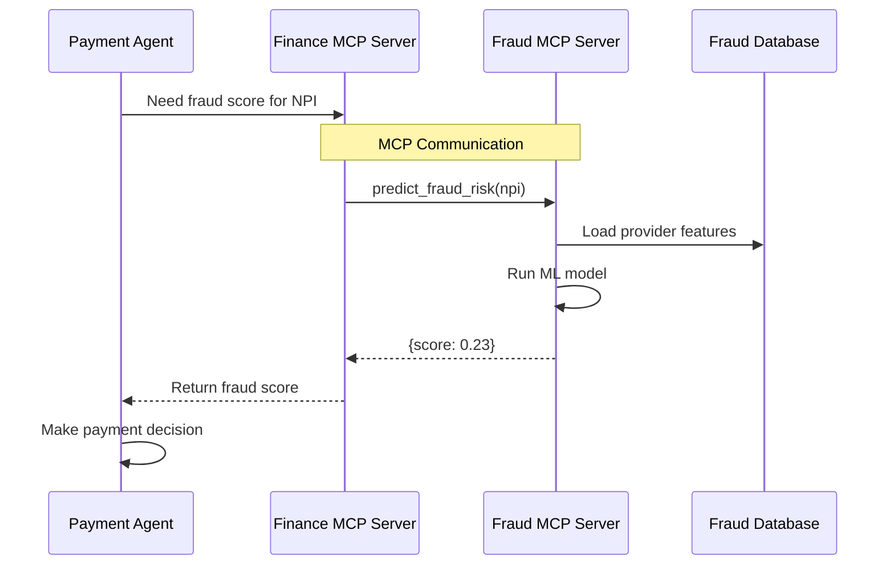

# Fraud Detection & Finance Application Integration Guide

**Version:** 1.0  
**Date:** 2024-11-30  
**Author:** Healthcare Fraud Detection Team

---

## 📋 Table of Contents

1. [System Architecture Overview](#system-architecture-overview)
2. [MCP Integration Layer](#mcp-integration-layer)
3. [Communication Flow](#communication-flow)
4. [Step-by-Step Integration](#step-by-step-integration)
5. [Testing the Integration](#testing-the-integration)
6. [Troubleshooting](#troubleshooting)

---

## 1. System Architecture Overview

### Applications

#### **Fraud Detection Application**
- **Location:** `/HealthCareFraudDetection-master/`
- **Port:** 8000
- **Purpose:** Detects fraudulent healthcare providers using ML models
- **Tech Stack:** FastAPI, TensorFlow, SHAP, LangGraph
- **MCP Server:** `mcp_server.py` (exposes fraud detection tools)

#### **Finance Application**
- **Location:** `/HealthCareFraudDetection-master/finance-app/`
- **Port:** 8001
- **Purpose:** Autonomous payment processing based on fraud risk
- **Tech Stack:** FastAPI, SQLite, Chart.js
- **MCP Server:** `mcp_server.py` (exposes payment tools)

### Integration Architecture

```
┌─────────────────────────────────────────────────────────────────┐
│                     BIDIRECTIONAL MCP INTEGRATION               │
└─────────────────────────────────────────────────────────────────┘

┌──────────────────────────────┐         ┌──────────────────────────────┐
│   Fraud Detection App        │         │      Finance App             │
│   Port: 8000                 │◄───────►│      Port: 8001              │
│                              │   MCP   │                              │
│  ┌────────────────────────┐  │         │  ┌────────────────────────┐  │
│  │  Fraud MCP Server      │  │         │  │  Finance MCP Server    │  │
│  │  - predict_fraud_risk  │  │         │  │  - process_payment     │  │
│  │  - explain_fraud_risk  │  │         │  │  - get_payment_history │  │
│  │  - get_provider_data   │  │         │  │  - get_risk_signals    │  │
│  └────────────────────────┘  │         │  └────────────────────────┘  │
│                              │         │                              │
│  ┌────────────────────────┐  │         │  ┌────────────────────────┐  │
│  │  Agents                │  │         │  │  Agents                │  │
│  │  - Supervisor          │  │         │  │  - Payment Agent       │  │
│  │  - Analyst             │  │──calls──►│  │  - Reconciliation      │  │
│  │  - Investigator        │  │◄─calls──│  │  - Audit Agent         │  │
│  └────────────────────────┘  │         │  └────────────────────────┘  │
│                              │         │                              │
│  ┌────────────────────────┐  │         │  ┌────────────────────────┐  │
│  │  Database              │  │         │  │  Database              │  │
│  │  - Provider features   │  │         │  │  - Payment profiles    │  │
│  │  - Risk scores         │  │         │  │  - Transactions        │  │
│  └────────────────────────┘  │         │  └────────────────────────┘  │
└──────────────────────────────┘         └──────────────────────────────┘
```

---

## 2. MCP Integration Layer

### What is MCP?

**Model Context Protocol (MCP)** enables machine-to-machine (M2M) communication between AI applications. It allows:
- **Tool Exposure:** Each app exposes its capabilities as callable tools
- **Bidirectional Communication:** Apps can call each other's tools
- **Structured Data Exchange:** JSON-based request/response
- **Audit Trail:** All communications are logged

### MCP Endpoints

#### **Fraud Detection MCP Server** (`/HealthCareFraudDetection-master/mcp_server.py`)

| Tool | Description | Input | Output |
|------|-------------|-------|--------|
| `predict_fraud_risk` | Calculate fraud risk score | `npi: int` | `score: float (0-1)` |
| `explain_fraud_risk` | Get SHAP explanations | `npi: int` | `{features, shap_values}` |
| `get_provider_data` | Get provider details | `npi: int` | `{name, state, specialty, ...}` |

#### **Finance MCP Server** (`/finance-app/mcp_server.py`)

| Tool | Description | Input | Output |
|------|-------------|-------|--------|
| `process_payment_request` | Process payment with autonomous agent | `npi, action, amount, fraud_confidence, reasoning` | `{decision, confidence, reasoning}` |
| `get_payment_history` | Retrieve payment history | `npi: int, months: int` | `{transactions[]}` |
| `get_payment_risk_signals` | Get payment-specific risk indicators | `npi: int` | `{risk_signals}` |
| `report_payment_outcome` | Report fraud outcome for learning | `transaction_id, actual_fraud, notes` | `{success}` |

---

## 3. Communication Flow

### Workflow: Fraud Detection → Payment Processing



### Workflow: Finance → Fraud Detection (Query)



---

## 4. Step-by-Step Integration

### Prerequisites

✅ **Both applications installed and databases ready:**
- Fraud Detection: Provider features loaded, ML model trained
- Finance: Provider financial profiles loaded (104K providers, $20.7B)

✅ **Dependencies installed:**
```bash
# In both directories
pip install fastapi uvicorn mcp sqlite3 pandas
```

### Step 1: Start Fraud Detection MCP Server

```bash
cd /HealthCareFraudDetection-master
python mcp_server.py
```

**Expected Output:**
```
Fraud MCP Server ready
INFO:     Started server process
INFO:     Uvicorn running on http://0.0.0.0:8765
```

**Verify:** 
- MCP server running on port 8765
- Tools exposed: `predict_fraud_risk`, `explain_fraud_risk`, `get_provider_data`

### Step 2: Start Finance MCP Server

```bash
cd /HealthCareFraudDetection-master/finance-app
python mcp_server.py
```

**Expected Output:**
```
Finance MCP Server initializing...
Database: data/finance.db
Finance MCP Server ready
INFO:     Uvicorn running on http://0.0.0.0:8766
```

**Verify:**
- MCP server running on port 8766
- Tools exposed: `process_payment_request`, `get_payment_history`, etc.
- Database connected: `data/finance.db`

### Step 3: Start Fraud Detection Web App

```bash
cd /HealthCareFraudDetection-master
python api_server.py
```

**Expected Output:**
```
INFO:     Uvicorn running on http://0.0.0.0:8000
```

**Verify:** Visit http://localhost:8000

### Step 4: Start Finance Web App

```bash
cd /HealthCareFraudDetection-master/finance-app
python api_server.py
```

**Expected Output:**
```
INFO:     Uvicorn running on http://0.0.0.0:8001
```

**Verify:** Visit http://localhost:8001

### Step 5: Test MCP Communication

Create a test script to verify bidirectional communication:

```python
# test_mcp_integration.py
import requests
import json

# Test 1: Fraud Detection → Finance
print("Test 1: Fraud Detection calling Finance MCP")
fraud_to_finance = {
    "tool": "process_payment_request",
    "arguments": {
        "npi": 1234567890,
        "action": "HOLD",
        "amount": 50000.00,
        "fraud_confidence": 0.75,
        "reasoning": "Medium-high fraud risk detected"
    }
}

response = requests.post(
    "http://localhost:8766/call-tool",
    json=fraud_to_finance
)
print(f"Response: {response.json()}")

# Test 2: Finance → Fraud Detection  
print("\nTest 2: Finance calling Fraud Detection MCP")
finance_to_fraud = {
    "tool": "predict_fraud_risk",
    "arguments": {
        "npi": 1234567890
    }
}

response = requests.post(
    "http://localhost:8765/call-tool",
    json=finance_to_fraud
)
print(f"Response: {response.json()}")
```

---

## 5. Testing the Integration

### Test Case 1: End-to-End Payment Processing

**Objective:** Verify complete workflow from fraud detection to payment decision

**Steps:**

1. **Login to Fraud Detection App**
   - Navigate to http://localhost:8000
   - Login: `username: admin`, `password: admin123`

2. **Analyze a Provider**
   - Click "Investigation"
   - Enter NPI: `1003000126` (example)
   - Click "Analyze Provider"

3. **Review Fraud Analysis**
   - Check risk score (e.g., 0.85 = High Risk)
   - Review SHAP explanations
   - Note Supervisor decision: "STOP PAYMENT"

4. **Check Finance App**
   - Navigate to http://localhost:8001
   - Login: `username: admin`, `password: finance2024`
   - Go to "Payments" page
   - Look for recent transaction with the NPI

5. **Verify Payment Decision**
   - Payment status should reflect fraud decision
   - Agent decision should show autonomous logic applied
   - Confidence score should be displayed

**Expected Results:**
```
✅ Fraud score calculated correctly
✅ Payment request sent via MCP
✅ Finance agent made autonomous decision
✅ Decision logged in finance database
✅ Both UIs show consistent information
```

### Test Case 2: Payment History Query

**Objective:** Verify Finance can query payment history

**Steps:**

1. **From Finance App Dashboard**
   - Navigate to http://localhost:8001/providers
   - Search for NPI: `1003000126`

2. **View Provider Profile**
   - Click on provider card
   - Review payment history table

3. **Verify Data Consistency**
   - Check total payments match database
   - Verify transaction count
   - Confirm fraud scores are displayed

**Expected Results:**
```
✅ Payment history retrieved
✅ Transaction details accurate
✅ Provider financial profile loaded
✅ Risk indicators displayed
```

### Test Case 3: Fraud Score Integration

**Objective:** Verify Finance can get real-time fraud scores

**Script Test:**
```bash
cd /HealthCareFraudDetection-master/finance-app
python -c "
from mcp.client import MCPClient

# Connect to Fraud Detection MCP
client = MCPClient('http://localhost:8765')

# Call fraud detection tool
result = client.call_tool('predict_fraud_risk', {'npi': 1003000126})
print(f'Fraud Score: {result}')
"
```

**Expected Output:**
```
Fraud Score: 0.8534
✅ MCP connection successful
✅ Fraud score retrieved
✅ Score matches fraud detection database
```

### Test Case 4: Bidirectional Audit Trail

**Objective:** Verify all MCP communications are logged

**Steps:**

1. **Check Finance MCP Logs**
   ```sql
   sqlite3 finance-app/data/finance.db
   SELECT * FROM mcp_communication_logs ORDER BY created_at DESC LIMIT 10;
   ```

2. **Verify Log Contents**
   - Source system: "fraud_detection"
   - Target system: "finance"
   - Tool name: "process_payment_request"
   - Request/response payloads present
   - Latency recorded

**Expected Results:**
```
✅ All MCP calls logged
✅ Request/response payloads stored
✅ Latency measured
✅ Audit trail complete
```

### Test Case 5: Agent Decision Validation

**Objective:** Verify Payment Agent uses fraud scores correctly

**Manual Test:**

1. **Submit Payment Requests with Different Risk Levels**

| Fraud Score | Expected Decision | Expected Confidence |
|-------------|-------------------|---------------------|
| 0.95 | REJECT | 95% |
| 0.75 | HOLD | 85% |
| 0.25 | APPROVE | 90% |

2. **Verify in Finance Database**
   ```sql
   SELECT transaction_id, fraud_risk_score, agent_decision, agent_confidence 
   FROM payment_transactions 
   ORDER BY created_at DESC LIMIT 5;
   ```

**Expected Results:**
```
✅ Decisions match fraud scores
✅ Confidence levels appropriate
✅ Reasoning captured
✅ No contradictions
```

---

## 6. Troubleshooting

### Issue: MCP Server Not Responding

**Symptoms:**
- `Connection refused` errors
- Timeout on MCP calls

**Solutions:**
1. Check server is running: `ps aux | grep mcp_server`
2. Verify port not in use: `lsof -i :8765` or `lsof -i :8766`
3. Check firewall settings
4. Review server logs for errors

### Issue: Tools Not Found

**Symptoms:**
- `Tool 'process_payment_request' not found`

**Solutions:**
1. Verify MCP server started successfully
2. Check tool registration in `mcp_server.py`
3. Ensure `@mcp.tool()` decorator present
4. Restart MCP server

### Issue: Database Connection Errors

**Symptoms:**
- `no such table: payment_transactions`
- `database is locked`

**Solutions:**
1. Verify database exists: `ls -lh finance-app/data/finance.db`
2. Check database permissions
3. Run database setup: `python finance-app/src/data/setup_database.py`
4. Close other connections to database

### Issue: Inconsistent Data

**Symptoms:**
- Fraud scores don't match
- Payment amounts incorrect

**Solutions:**
1. Verify NPIs match across systems
2. Check data synchronization
3. Refresh provider features
4. Re-aggregate payment data

### Issue: Authentication Failures

**Symptoms:**
- `401 Unauthorized` on API calls

**Solutions:**
1. Check session cookies
2. Re-login to application
3. Verify credentials in `USERS` dict
4. Clear browser cache

---

## 7. Integration Checklist

### Pre-Deployment

- [ ] Both databases populated with data
- [ ] ML models trained and verified
- [ ] MCP servers tested independently
- [ ] Network connectivity verified
- [ ] Ports 8000, 8001, 8765, 8766 available

### Deployment

- [ ] Start Fraud MCP Server (port 8765)
- [ ] Start Finance MCP Server (port 8766)
- [ ] Start Fraud Web App (port 8000)
- [ ] Start Finance Web App (port 8001)
- [ ] Verify all services healthy

### Post-Deployment Testing

- [ ] Run integration test suite
- [ ] Verify MCP communication logs
- [ ] Check database audit trails
- [ ] Review agent decision accuracy
- [ ] Monitor system performance

### Monitoring

- [ ] Set up health checks
- [ ] Monitor MCP latency
- [ ] Track agent decision rates
- [ ] Review error logs daily
- [ ] Validate data consistency

---

## 8. Advanced Integration Scenarios

### Scenario 1: Real-Time Fraud Alerts → Automated Payment Holds

**Flow:**
1. Fraud Detection continuously monitors providers
2. When risk score exceeds threshold (>0.85)
3. Automatically call Finance MCP: `process_payment_request()`
4. Finance Agent holds all pending payments
5. Alert sent to human reviewers

### Scenario 2: Payment Pattern Analysis → Fraud Investigation

**Flow:**
1. Finance detects unusual payment pattern
2. Call Fraud MCP: `explain_fraud_risk(npi)`
3. Get SHAP explanations for provider
4. If suspicious, trigger investigation workflow
5. Log results back to Finance via `report_payment_outcome()`

### Scenario 3: Reinforcement Learning Loop

**Flow:**
1. Payment Agent makes decision
2. Actual fraud outcome determined (later)
3. Call `report_payment_outcome()` with ground truth
4. Both systems update models
5. Decision accuracy improves over time

---

## 9. Performance Benchmarks

### Target Metrics

| Metric | Target | Measured |
|--------|--------|----------|
| MCP Call Latency | <100ms | TBD |
| Payment Decision Time | <500ms | TBD |
| Fraud Score Calculation | <200ms | TBD |
| Database Query Time | <50ms | TBD |
| End-to-End Workflow | <2s | TBD |

### Load Testing

```bash
# Test MCP throughput
ab -n 1000 -c 10 http://localhost:8766/call-tool

# Test concurrent fraud analyses
python load_test_integration.py --requests 100 --concurrent 10
```

---

## 10. Security Considerations

### MCP Communication

- [ ] Use HTTPS in production
- [ ] Implement API key authentication
- [ ] Encrypt sensitive payloads
- [ ] Rate limit MCP calls
- [ ] Validate all inputs

### Data Protection

- [ ] HIPAA compliance for PII
- [ ] Encrypt databases at rest
- [ ] Secure session management
- [ ] Audit all access
- [ ] Regular security reviews

---

## 11. Future Enhancements

### Planned Features

1. **WebSocket Integration** - Real-time bidirectional updates
2. **Event Streaming** - Apache Kafka for asynchronous communication
3. **GraphQL API** - Flexible data querying across systems
4. **Blockchain Audit** - Immutable decision trail
5. **Multi-Agent Consensus** - Collaborative decision-making

### Roadmap

- **Q1 2025:** WebSocket real-time integration
- **Q2 2025:** Event streaming with Kafka
- **Q3 2025:** Blockchain audit trail
- **Q4 2025:** Multi-agent consensus system

---

## 📞 Support

For issues or questions:
- **Email:** healthcare-fraud-team@example.com
- **Slack:** #fraud-finance-integration
- **Documentation:** `/docs/AUTONOMOUS_FINANCE_INTEGRATION_DESIGN.md`

---

**End of Integration Guide** ✅
