# FraudGuard - ML Pipeline, CI/CD & Algorithm Diagrams

## Table of Contents
1. [ML Training Pipeline](#1-ml-training-pipeline)
2. [ML Inference Pipeline](#2-ml-inference-pipeline)
3. [Model Architecture](#3-model-architecture)
4. [Algorithm Diagrams](#4-algorithm-diagrams)
5. [CI/CD Pipeline](#5-cicd-pipeline)
6. [Deployment Workflows](#6-deployment-workflows)

---

## 1. ML Training Pipeline

### 1.1 Complete Training Workflow

```mermaid
flowchart TB
    START([Start Training]) --> CHECK_FEATURE{Feature Store<br/>Exists?}
    
    CHECK_FEATURE -->|Yes| LOAD_FEATURES[Load Pre-computed Features<br/>from CSV]
    CHECK_FEATURE -->|No| LOAD_RAW[Load Raw Data<br/>Physician, Prescriber, LEIE]
    
    LOAD_RAW --> MERGE[Merge Datasets on NPI]
    MERGE --> ENGINEER[Feature Engineering Pipeline]
    
    subgraph "Feature Engineering"
        ENGINEER --> BASE_FEAT[Calculate Base Features<br/>6 metrics]
        BASE_FEAT --> SPECIALTY_STATS[Calculate Specialty Statistics<br/>Group by specialty]
        SPECIALTY_STATS --> ZSCORE[Calculate Z-Scores<br/>Normalize by specialty]
        ZSCORE --> KMEANS_FIT[Fit K-Means Clustering<br/>n_clusters=5]
        KMEANS_FIT --> BUILD_GRAPH[Build Similarity Graph<br/>Cosine similarity]
        BUILD_GRAPH --> PAGERANK[Calculate PageRank<br/>Network centrality]
        PAGERANK --> SAVE_FEATURES[Save to Feature Store]
    end
    
    SAVE_FEATURES --> SPLIT
    LOAD_FEATURES --> SPLIT[Train-Val-Test Split<br/>60-20-20]
    
    SPLIT --> LABEL{Labeling<br/>Method?}
    LABEL -->|Supervised| LEIE_LABEL[LEIE-based Labels<br/>Match with exclusion list]
    LABEL -->|Unsupervised| ZSCORE_LABEL[Z-Score based Labels<br/>combined_z > 3.0]
    
    LEIE_LABEL --> SMOTE
    ZSCORE_LABEL --> SMOTE[Apply SMOTE<br/>Balance classes]
    
    SMOTE --> CLASS_WEIGHTS[Calculate Class Weights<br/>Handle remaining imbalance]
    
    CLASS_WEIGHTS --> BUILD_MODEL[Build Deep Learning Model<br/>Input: 11 features<br/>Output: Fraud probability]
    
    subgraph "Model Architecture"
        BUILD_MODEL --> LAYER1[Dense Layer 64<br/>PReLU, BatchNorm, Dropout]
        LAYER1 --> LAYER2[Dense Layer 32<br/>PReLU, BatchNorm, Dropout]
        LAYER2 --> OUTPUT[Dense Layer 1<br/>Sigmoid activation]
    end
    
    OUTPUT --> COMPILE[Compile Model<br/>Loss: Focal Crossentropy<br/>Optimizer: Adam<br/>Metrics: AUC]
    
    COMPILE --> CALLBACKS[Setup Callbacks<br/>EarlyStopping, ReduceLR]
    
    CALLBACKS --> TRAIN_LOOP[Training Loop<br/>Epochs: 50<br/>Batch: 2048]
    
    TRAIN_LOOP --> EPOCH{Epoch<br/>Complete?}
    EPOCH -->|Continue| VAL[Validation]
    VAL --> CHECK_EARLY{Early<br/>Stopping?}
    CHECK_EARLY -->|No| TRAIN_LOOP
    CHECK_EARLY -->|Yes| SAVE_MODEL
    EPOCH -->|Max epochs| SAVE_MODEL[Save Model<br/>saved_models/fraud_model.h5]
    
    SAVE_MODEL --> EVALUATE[Evaluate on Test Set<br/>Calculate metrics]
    
    subgraph "Evaluation"
        EVALUATE --> METRICS[Calculate Metrics<br/>Accuracy, Precision, Recall, F1, AUC]
        METRICS --> CONFUSION[Generate Confusion Matrix]
        CONFUSION --> PR_CURVE[Plot Precision-Recall Curve]
    end
    
    PR_CURVE --> SHAP_GEN[Generate SHAP Explanations<br/>Sample 100 test instances]
    
    SHAP_GEN --> SHAP_PLOT[Create SHAP Summary Plot<br/>Feature importance visualization]
    
    SHAP_PLOT --> LLM_REPORT[Generate LLM Report<br/>Narrative analysis]
    
    LLM_REPORT --> END([Training Complete])
    
    style START fill:#2ECC71,stroke:#27AE60,color:#fff
    style END fill:#E74C3C,stroke:#C0392B,color:#fff
    style BUILD_MODEL fill:#9B59B6,stroke:#8E44AD,color:#fff
    style SMOTE fill:#F39C12,stroke:#E67E22,color:#fff
    style SHAP_GEN fill:#3498DB,stroke:#2980B9,color:#fff
```

### 1.2 Feature Engineering Detail

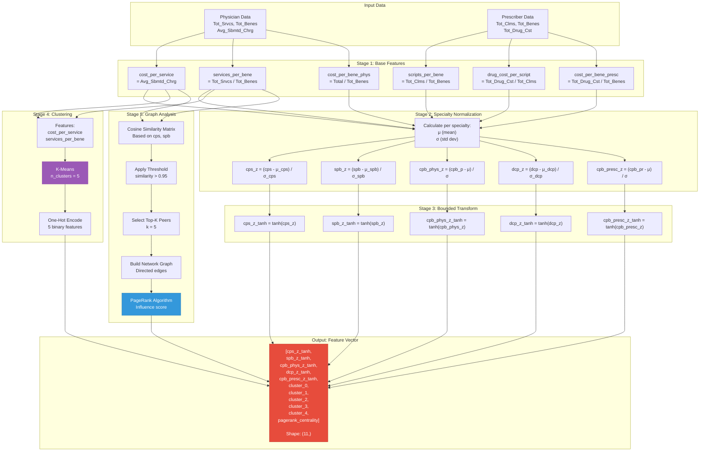

---

## 2. ML Inference Pipeline

### 2.1 Real-time Inference Flow

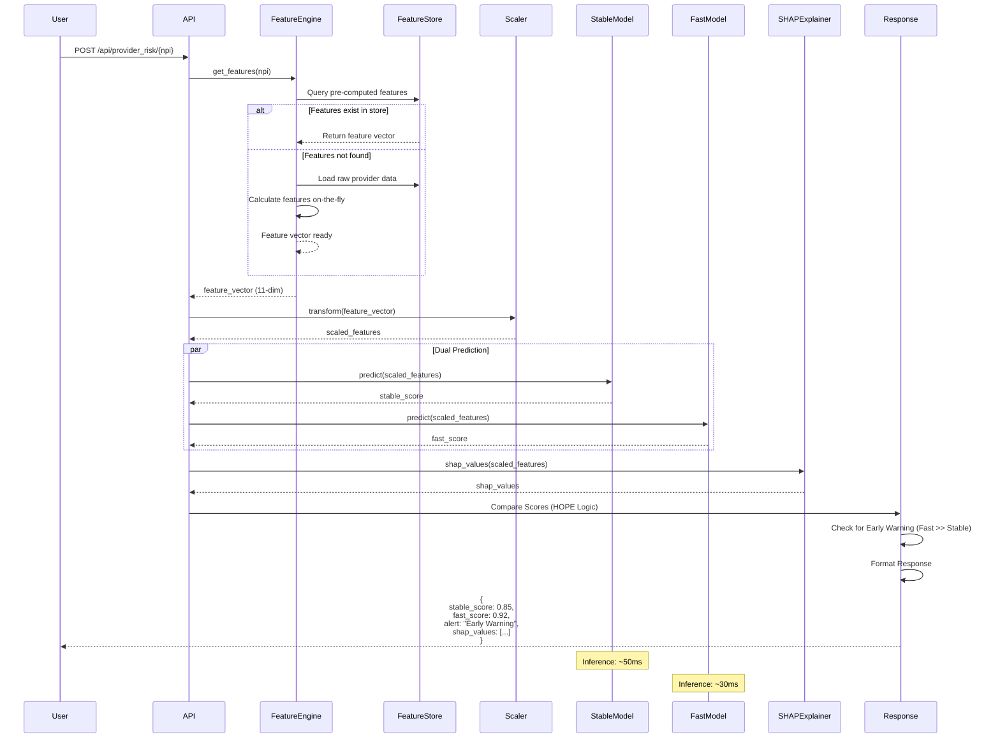

### 2.2 Batch Inference (Monitor Agent)

```mermaid
flowchart TD
    START([Monitor Agent Start]) --> LOAD_STATE[Load State<br/>current offset]
    
    LOAD_STATE --> QUERY[Query Database<br/>Get 100 providers<br/>OFFSET current_offset]
    
    QUERY --> BATCH_LOOP[For each provider in batch]
    
    BATCH_LOOP --> GET_FEATURES[Get Feature Vector<br/>From feature store]
    
    GET_FEATURES --> SCALE[Scale Features<br/>RobustScaler]
    
    SCALE --> BATCH_PREDICT[Batch Prediction<br/>model.predict(batch)]
    
    BATCH_PREDICT --> RISK_SCORES[Extract Risk Scores<br/>Array of 100 scores]
    
    RISK_SCORES --> CLASSIFY_BATCH[Classify Risk Levels<br/>HIGH/MEDIUM/LOW]
    
    CLASSIFY_BATCH --> UPDATE_DB[Update Database<br/>Batch UPDATE query]
    
    UPDATE_DB --> CALC_STATS[Calculate Aggregate Stats<br/>total, high_risk_count, avg_risk]
    
    CALC_STATS --> INC_OFFSET[Increment Offset<br/>offset += 100]
    
    INC_OFFSET --> SAVE_STATE[Save State<br/>monitor_state.json]
    
    SAVE_STATE --> SLEEP[Sleep 60 seconds]
    
    SLEEP --> QUERY
    
    style START fill:#2ECC71,stroke:#27AE60,color:#fff
    style BATCH_PREDICT fill:#9B59B6,stroke:#8E44AD,color:#fff
    style UPDATE_DB fill:#3498DB,stroke:#2980B9,color:#fff
```

---

## 3. Model Architecture

### 3.1 Deep Neural Network Architecture

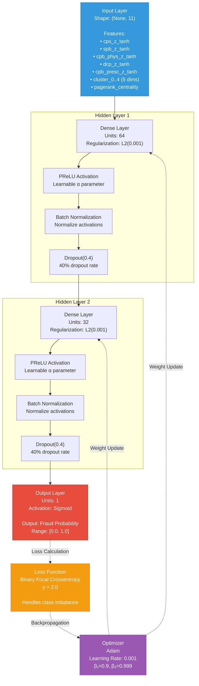

### 3.3 Nested Learning Architecture (HOPE)

The system uses a **Hybrid Online & Periodic Estimation (HOPE)** architecture to balance stability with responsiveness.

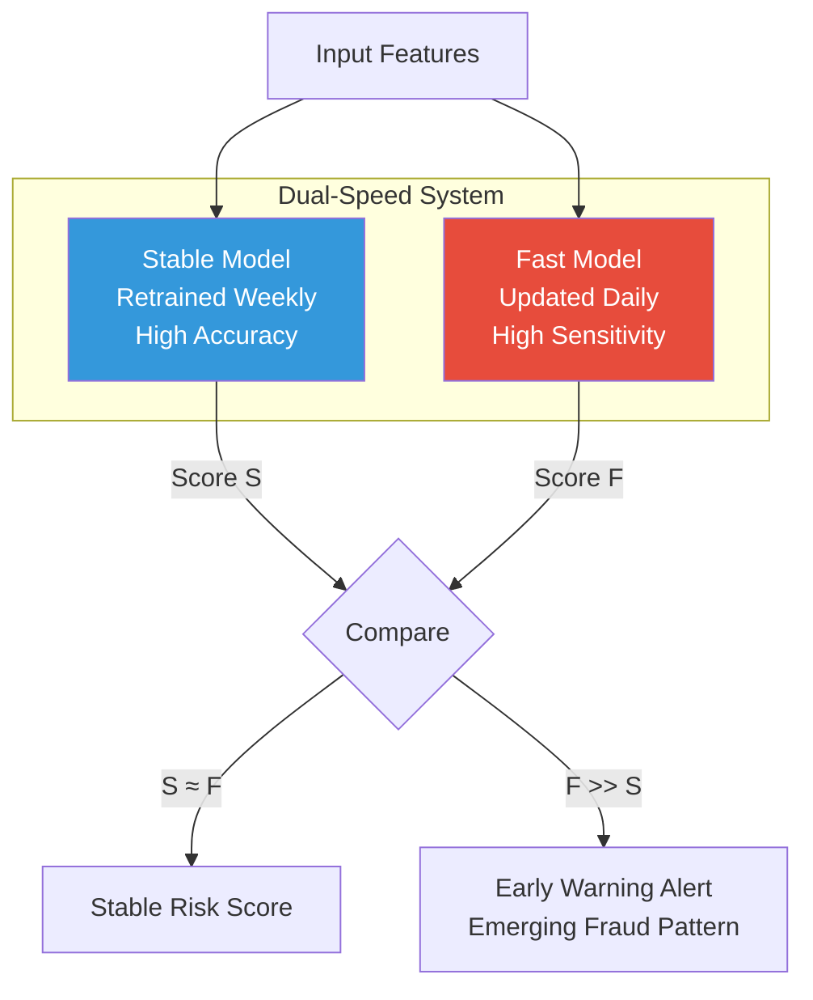

**Components**:
1.  **Stable Model**: The robust DNN described in 3.1. Retrained weekly on full verified dataset.
2.  **Fast Model**: Lightweight version updated daily with recent feedback and emerging patterns.
3.  **Comparison Logic**:
    - If scores are similar, confidence is high.
    - If Fast Model spikes while Stable is low, it triggers an "Early Warning".

---

### 3.2 Training Process Detail

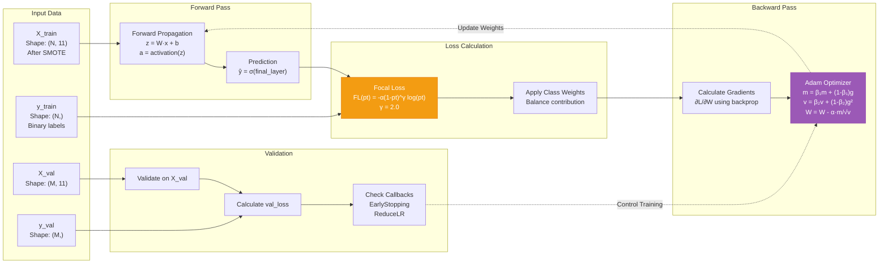

---

## 4. Algorithm Diagrams

> **Note**: For detailed mathematical explanations of all formulas used in these algorithms, see the [Mathematical Notation Guide](./TECHNICAL_DOCUMENTATION.md#mathematical-notation-guide) in the Technical Documentation.

### Algorithm Explanations

This section provides step-by-step explanations of the core algorithms used in the FraudGuard system.

#### 4.0.1 Risk Calculation Algorithm - Detailed Explanation

**Purpose**: Calculate a fraud risk score (0-1) for a healthcare provider based on billing patterns.

**Step-by-Step Process**:

1. **Extract Raw Metrics** from source data:
   - Physician data: `Tot_Srvcs`, `Tot_Benes`, `Avg_Sbmtd_Chrg`
   - Prescriber data: `Tot_Clms`, `Tot_Benes`, `Tot_Drug_Cst`

2. **Calculate 6 Base Features**:
   ```
   cost_per_service = Avg_Sbmtd_Chrg
   services_per_bene = Tot_Srvcs / Tot_Benes
   cost_per_bene_phys = (Avg_Sbmtd_Chrg × Tot_Srvcs) / Tot_Benes
   scripts_per_bene = Tot_Clms / Tot_Benes
   drug_cost_per_script = Tot_Drug_Cst / Tot_Clms
   cost_per_bene_presc = Tot_Drug_Cst / Tot_Benes
   ```
   **Why**: These ratios normalize billing across providers of different sizes.

3. **Specialty Normalization** (Z-Score Calculation):
   ```
   z = (value - specialty_mean) / specialty_std
   ```
   **Example**: Internal Medicine physician with cost_per_service = $150
   - Specialty mean = $100
   - Specialty std dev = $25
   - z = (150 - 100) / 25 = 2.0 (2 standard deviations above average)
   
   **Why**: Compares each provider to their specialty peers (cardiologists expected to cost more than family doctors).

4. **Tanh Transform** (Bounded Normalization):
   ```
   z_tanh = tanh(z)
   ```
   **Range**: [-1, 1]
   **Why**: Prevents extreme outliers from dominating the model. A provider 10 std devs above mean becomes ~1.0 instead of 10.0.

5. **Cluster Assignment** (K-Means):
   - Assigns provider to 1 of 5 archetypes based on cost and volume
   - One-hot encoded as 5 binary features
   **Why**: Captures practice patterns (e.g., high-cost specialist vs. high-volume routine care).

6. **PageRank** Centrality:
   - Measures provider's position in similarity network
   - High PageRank = similar to many other providers (central behavior)
   - Low PageRank = unique practice patterns (isolated)
   **Why**: Identifies referral networks and potential collusion patterns.

7. **Assemble 11-Dimensional Feature Vector**:
   ```
   [cps_z_tanh, spb_z_tanh, cpb_phys_z_tanh, dcp_z_tanh, cpb_presc_z_tanh,
    cluster_0, cluster_1, cluster_2, cluster_3, cluster_4,
    pagerank_centrality]
   ```

8. **Scale Features** with RobustScaler:
   - Centers features around median (robust to outliers)
   - Scales based on interquartile range

9. **Neural Network Forward Pass**:
   - Layer 1: 11 → 64 neurons (feature extraction)
   - Layer 2: 64 → 32 neurons (abstract representation)
   - Output: 32 → 1 neuron (fraud probability)

10. **Sigmoid Activation**:
    ```
    risk_score = 1 / (1 + e^(-x))
    ```
    Converts network output to probability in [0, 1].

11. **Classification**:
    - risk > 0.7: HIGH
    - 0.4 ≤ risk ≤ 0.7: MEDIUM
    - risk < 0.4: LOW

**Example End-to-End**:
- Provider bills $300/service (specialty avg: $100, std: $50)
- z-score: (300-100)/50 = 4.0 (very high!)
- tanh(4.0) = 0.9993
- After neural network: risk_score = 0.92
- Classification: HIGH RISK

---

#### 4.0.2 SHAP Explanation Algorithm - Detailed Explanation

**Purpose**: Explain *why* the model assigned a specific risk score by calculating each feature's contribution.

**The Problem**: A neural network gives a risk score, but doesn't explain which features drove that score.

**The Solution**: SHAP (SHapley Additive exPlanations) uses game theory to fairly distribute credit.

**Key Concept**: Shapley values from cooperative game theory.
- **Players**: Features (cost_per_service, services_per_bene, etc.)
- **Game**: Predicting fraud risk
- **Payout**: Final prediction - baseline prediction
- **Question**: How much should each feature be "paid" for its contribution?

**Step-by-Step Process**:

1. **Initialize Background Dataset**:
   - Sample 100 random training examples
   - These represent "typical" provider profiles

2. **Calculate Baseline Prediction**:
   ```
   E[f(x)] = average prediction over background data
   ```
   **Example**: Baseline = 0.12 (12% average risk across all providers)

3. **For Each Feature i**:
   - Generate all possible subsets of other features (called "coalitions")
   - **Example**: For 3 features {A, B, C}, coalitions for feature A:
     - {} (no features)
     - {B}
     - {C}
     - {B, C}

4. **Calculate Marginal Contribution**:
   For each coalition S:
   ```
   Δ = f(S ∪ {i}) - f(S)
   ```
   **Meaning**: Prediction with feature i included - prediction without

   **Example**:
   - f({cost, volume}) = 0.7
   - f({cost, volume, centrality}) = 0.85
   - Δ = 0.85 - 0.7 = 0.15 (centrality adds +0.15 to risk)

5. **Weight by Coalition Size**:
   ```
   weight = |S|! × (n - |S| - 1)! / n!
   ```
   **Why**: Gives more weight to coalitions of medium size
   - Small coalitions (few features): Less reliable
   - Large coalitions (many features): Less informative about feature i

6. **Accumulate Weighted Contributions**:
   ```
   φᵢ = Σ [weight × Δ]
   ```
   **Result**: Feature i's SHAP value

7. **Normalization Property**:
   ```
   Σφᵢ = f(x) - E[f(x)]
   ```
   **Example**: If prediction = 0.85 and baseline = 0.12:
   - Total to distribute: 0.85 - 0.12 = 0.73
   - SHAP values sum to 0.73

8. **Interpret SHAP Values**:
   ```
   Prediction = Baseline + SHAP₁ + SHAP₂ + ... + SHAPₙ
              = 0.12    + 0.40  + 0.25  + ... + 0.08
              = 0.85
   ```

**Example SHAP Breakdown**:
```
Feature                   Value       SHAP    Interpretation
────────────────────────────────────────────────────────────
Baseline                               0.12   Average provider
cost_per_service         $300         +0.40   Very high cost (+40%)
services_per_bene        60           +0.25   High volume (+25%)
cluster_1 (High Risk)    Yes          +0.10   Risky archetype (+10%)
pagerank_centrality      0.02         -0.02   Not well-connected (-2%)
────────────────────────────────────────────────────────────
Final Prediction                       0.85   85% fraud risk
```

**Visualization** (Waterfall Chart):
```
0.12 (Baseline) 
  → +0.40 (Cost pushed right)
    → +0.25 (Volume pushed right)
      → +0.10 (Cluster pushed right)
        → -0.02 (Centrality pulled left)
          = 0.85 (Final)
```

---

#### 4.0.3 Network Analysis (PageRank) - Detailed Explanation

**Purpose**: Identify providers who are central in the similarity network (potential fraud rings or referral schemes).

**Analogy**: Google's PageRank for web pages, applied to provider similarity.

**Key Idea**: A provider is "important" if similar to many other providers who are themselves important.

**Step-by-Step Process**:

1. **Extract Features** for all providers:
   - cost_per_service
   - services_per_bene

2. **Build N×2 Feature Matrix**:
   ```
   [provider_1]: [100, 20]
   [provider_2]: [105, 22]
   ...
   [provider_N]: [95, 18]
   ```

3. **Calculate Cosine Similarity** between all pairs:
   ```
   sim(i,j) = (xᵢ · xⱼ) / (||xᵢ|| × ||xⱼ||)
   ```
   **Example**: Providers A=[100, 20] and B=[200, 40]:
   - Dot product: 100×200 + 20×40 = 20,800
   - Magnitude A: √(100² + 20²) = 101.98
   - Magnitude B: √(200² + 40²) = 203.96
   - Similarity: 20,800/(101.98×203.96) = 0.999 (nearly identical!)

4. **Apply Threshold** (0.95):
   - Only keep edges where similarity > 0.95
   - **Rationale**: Focus on very similar providers

5. **Select Top-K** (k=5):
   - For each provider, keep only 5 most similar peers
   - **Why**: Prevents highly connected hubs from dominating

6. **Build Directed Graph**:
   - Nodes: Providers
   - Edges: Provider i → j if j is in top-5 most similar to i

7. **Initialize PageRank**:
   ```
   PR(v) = 1/N for all providers
   ```
   **Example**: 10,000 providers → PR(v) = 0.0001 initially

8. **Iterate PageRank Formula**:
   ```
   PR'(v) = (1-d)/N + d × Σ [PR(u) / L(u)]
   ```
   **Variables**:
   - `d = 0.85`: Damping factor (probability of following a link)
   - `N`: Total providers
   - `PR(u)`: Current PageRank of provider u
   - `L(u)`: Number of outgoing links from u
   - `Σ`: Sum over all u that link to v

   **Intuition**:
   - 15% chance: Random jump to any provider (1-d)/N
   - 85% chance: Follow a link from similar provider

9. **Converge**:
   - Repeat until `||PR' - PR|| < 1e-6`
   - Typically 30-50 iterations

10. **Interpret Results**:
    - **High PageRank (> 0.01)**: Hub provider with many similar peers
      - Could indicate referral network
      - Could indicate standard practice in specialty
    - **Low PageRank (< 0.001)**: Isolated provider with unique behavior
      - Could be specialized niche
      - Could be anomalous billing

**Example Scenario**:
```
Network:
  Provider A → similar to B, C, D, E, F (total 5)
  Provider B → similar to A, G, H (total 3)
  Provider C → similar to A, I (total 2)
  ...

After PageRank:
  A: PR = 0.025 (high centrality, well-connected hub)
  B: PR = 0.012 (moderate)
  C: PR = 0.008 (moderate)
  ...
```

**Fraud Detection Use**:
- High centrality + high risk score → Potential fraud ring leader
- Low centrality + high risk score → Isolated bad actor

---

#### 4.0.4 K-Means Clustering - Detailed Explanation

**Purpose**: Group providers into 5 behavioral archetypes based on cost and volume patterns.

**Why Clustering?**: 
- Captures non-linear patterns
- Creates interpretable archetypes
- Adds categorical features to model

**Step-by-Step Process**:

1. **Select Features**:
   - cost_per_service (x-axis)
   - services_per_bene (y-axis)

2. **Initialize 5 Centroids** randomly:
   ```
   C₁ = [50, 10]   (low cost, low volume)
   C₂ = [300, 80]  (high cost, high volume)
   C₃ = [60, 70]   (low cost, high volume)
   C₄ = [250, 15]  (high cost, low volume)
   C₅ = [150, 40]  (moderate, moderate)
   ```

3. **Assignment Step**:
   For each provider, calculate distance to each centroid:
   ```
   d = √[(x - cₓ)² + (y - cᵧ)²]
   ```
   Assign to nearest centroid.

   **Example**: Provider at [100, 25]
   - d(C₁) = √[(100-50)² + (25-10)²] = √2725 = 52.2
   - d(C₂) = √[(100-300)² + (25-80)²] = √43025 = 207.5
   - d(C₃) = √[(100-60)² + (25-70)²] = √3625 = 60.2
   - d(C₄) = √[(100-250)² + (25-15)²] = √22600 = 150.3
   - d(C₅) = √[(100-150)² + (25-40)²] = √2725 = 52.2
   - **Nearest**: C₁ or C₅ (tie → choose C₁)

4. **Update Step**:
   For each cluster k, calculate new centroid as mean of all assigned points:
   ```
   c_k = (1/|k|) × Σ[all points in cluster k]
   ```

5. **Convergence Check**:
   - If centroids didn't move: STOP
   - Else: Repeat assignment and update

6. **Final Cluster Interpretation**:
   ```
   Cluster 0: Routine Care
     - Low cost ($50-100/service)
     - Low volume (10-30 services/bene)
     - Examples: Primary care, preventive medicine

   Cluster 1: Elevated Risk Profile  
     - High cost ($200+/service)
     - High volume (60+ services/bene)
     - FRAUD INDICATOR: Unusual to have both high

   Cluster 2: High Volume Operators
     - Low cost ($50-80/service)
     - High volume (60+ services/bene)
     - Examples: Urgent care, walk-in clinics

   Cluster 3: Specialist Care
     - High cost ($200+/service)
     - Low volume (5-20 services/bene)
     - Examples: Surgical specialists, rare procedures

   Cluster 4: Balanced Practice
     - Moderate cost ($100-150/service)
     - Moderate volume (30-50 services/bene)
     - Examples: General specialists
   ```

7. **One-Hot Encoding**:
   Convert cluster assignment to 5 binary features:
   ```
   Provider in Cluster 1 → [0, 1, 0, 0, 0]
   Provider in Cluster 3 → [0, 0, 0, 1, 0]
   ```

**Model Usage**:
- Neural network learns that Cluster 1 is risky
- Cluster 3 is legitimate but expensive
- Provides context missing from raw cost/volume alone

---

#### 4.0.5 Anomaly Detection - Detailed Explanation

**Purpose**: Rule-based initial screening before ML model.

**Philosophy**: Quick, interpretable red flags that don't require complex computation.

**7-Rule System**:

**Rule 1: Excessive Cost**
```
IF cost_per_service > $200 THEN FLAG: HIGH
```
**Rationale**: Medicare average is ~$100. Above $200 suggests upcoding or unnecessary procedures.

**Rule 2: High Volume**
```
IF services_per_bene > 50 THEN FLAG: MEDIUM
```
**Rationale**: Average is 20-30. Above 50 suggests overutilization or billing for services not rendered.

**Rule 3: Excessive Billing**
```
IF cost_per_bene > $5000 THEN FLAG: HIGH  
```
**Rationale**: Annual Medicare spending averages $3000/beneficiary. Much higher suggests fraud.

**Rule 4: Expensive Drugs**
```
IF drug_cost_per_script > $500 THEN FLAG: MEDIUM
```
**Rationale**: Median prescription cost is $50-100. High-cost drugs should be rare.

**Rule 5: Highly Connected**
```
IF pagerank_centrality > 0.01 THEN FLAG: LOW
```
**Rationale**: Very connected providers mayindicate referral rings. Needs investigation.

**Rule 6: Cost Outlier**
```
IF cps_z_tanh > 0.8 THEN FLAG: HIGH
```
**Rationale**: tanh(3) ≈ 0.995, so 0.8 means ~2 std devs above specialty mean. Statistical outlier.

**Rule 7: Volume Outlier**
```
IF spb_z_tanh > 0.8 THEN FLAG: HIGH
```
**Rationale**: Same as Rule 6, for volume instead of cost.

**Severity Classification**:
- **0 flags**: CLEAN (no investigation needed)
- **1-2 flags**: REVIEW (minor anomalies, worth checking)
- **3+ flags**: ALERT (multiple red flags, priority investigation)

**Example**:
```
Provider X:
  cost_per_service = $350     → Rule 1: ✓ HIGH
  services_per_bene = 65      → Rule 2: ✓ MEDIUM
  cost_per_bene = $6,500      → Rule 3: ✓ HIGH
  drug_cost_per_script = $120 → Rule 4: ✗
  pagerank = 0.005            → Rule 5: ✗
  cps_z_tanh = 0.92           → Rule 6: ✓ HIGH
  spb_z_tanh = 0.75           → Rule 7: ✗

Total Flags: 4 → STATUS: ALERT
```

**Integration with ML**:
- Anomaly detection runs BEFORE ML model
- Provides context for investigators
- ML model may override (e.g., specialist with legitimately high cost)
- Both used together for final decision

---

### 4.1 Risk Calculation Algorithm

```mermaid
flowchart TD
    START([Input: Provider Data]) --> EXTRACT[Extract Raw Metrics<br/>Physician + Prescriber data]
    
    EXTRACT --> CALC_BASE[Calculate Base Features]
    
    subgraph "Base Feature Calculation"
        CALC_BASE --> B1["cost_per_service = Avg_Sbmtd_Chrg"]
        CALC_BASE --> B2["services_per_bene = Tot_Srvcs / Tot_Benes"]
        CALC_BASE --> B3["cost_per_bene_phys = Total Cost / Tot_Benes"]
        CALC_BASE --> B4["scripts_per_bene = Tot_Clms / Tot_Benes"]
        CALC_BASE --> B5["drug_cost_per_script = Tot_Drug_Cst / Tot_Clms"]
        CALC_BASE --> B6["cost_per_bene_presc = Tot_Drug_Cst / Tot_Benes"]
    end
    
    B1 --> NORM
    B2 --> NORM
    B3 --> NORM
    B4 --> NORM
    B5 --> NORM
    B6 --> NORM
    
    NORM[Specialty Normalization] --> Z1["z₁ = (b₁ - μ₁) / σ₁"]
    NORM --> Z2["z₂ = (b₂ - μ₂) / σ₂"]
    NORM --> Z3["z₃ = (b₃ - μ₃) / σ₃"]
    NORM --> Z4["z₄ = (b₄ - μ₄) / σ₄"]
    NORM --> Z5["z₅ = (b₅ - μ₅) / σ₅"]
    NORM --> Z6["z₆ = (b₆ - μ₆) / σ₆"]
    
    Z1 --> T1["tanh(z₁)"]
    Z2 --> T2["tanh(z₂)"]
    Z3 --> T3["tanh(z₃)"]
    Z4 --> T4["tanh(z₄)"]
    Z5 --> T5["tanh(z₅)"]
    
    T1 --> VEC
    T2 --> VEC
    T3 --> VEC
    T4 --> VEC
    T5 --> VEC
    
    CLUSTER[Cluster Assignment<br/>K-Means prediction] --> VEC
    PAGERANK[PageRank Lookup<br/>From graph] --> VEC
    
    VEC[Assemble Feature Vector<br/>11 dimensions] --> SCALE[Scale with RobustScaler]
    
    SCALE --> MODEL[Deep Neural Network<br/>Forward Pass]
    
    MODEL --> SIGMOID[Sigmoid Activation<br/>σ(x) = 1/(1+e^-x)]
    
    SIGMOID --> RISK[Risk Score ∈ [0, 1]]
    
    RISK --> CLASSIFY{Classify}
    CLASSIFY -->|> 0.7| HIGH[HIGH RISK]
    CLASSIFY -->|0.4-0.7| MEDIUM[MEDIUM RISK]
    CLASSIFY -->|< 0.4| LOW[LOW RISK]
    
    HIGH --> END([Output: Risk Assessment])
    MEDIUM --> END
    LOW --> END
    
    style START fill:#2ECC71,stroke:#27AE60,color:#fff
    style END fill:#E74C3C,stroke:#C0392B,color:#fff
    style MODEL fill:#9B59B6,stroke:#8E44AD,color:#fff
```

### 4.2 SHAP Explanation Algorithm

```mermaid
flowchart TD
    START([Input: Feature Vector x]) --> INIT[Initialize SHAP DeepExplainer<br/>with background data]
    
    INIT --> SAMPLE[Sample Background Data<br/>100 random training examples]
    
    SAMPLE --> BASELINE[Calculate Baseline Prediction<br/>E[f(x)] over background]
    
    BASELINE --> COALITION[Generate Feature Coalitions<br/>All subsets of features]
    
    COALITION --> LOOP{For each<br/>coalition S}
    
    LOOP -->|More coalitions| INCLUDE[Predict with S ∪ {i}<br/>f(x_S∪i)]
    INCLUDE --> EXCLUDE[Predict without i<br/>f(x_S)]
    EXCLUDE --> DIFF[Calculate Difference<br/>Δ = f(x_S∪i) - f(x_S)]
    DIFF --> WEIGHT[Weight by Coalition Size<br/>w = |S|!(|N|-|S|-1)! / |N|!]
    WEIGHT --> ACCUMULATE[Accumulate Contribution<br/>φᵢ += w × Δ]
    ACCUMULATE --> LOOP
    
    LOOP -->|Done| NORMALIZE[Normalize SHAP Values<br/>Σφᵢ = f(x) - E[f(x)]]
    
    NORMALIZE --> SORT[Sort by Absolute Value<br/>|φ₁| ≥ |φ₂| ≥ ... ≥ |φₙ|]
    
    SORT --> TOP_K[Select Top K Features<br/>K = 5 most important]
    
    TOP_K --> FORMAT[Format Explanation<br/>Feature: Value → Impact]
    
    FORMAT --> VISUALIZE[Generate Waterfall Plot<br/>Base value → Prediction]
    
    VISUALIZE --> END([Output: SHAP Explanation])
    
    style START fill:#2ECC71,stroke:#27AE60,color:#fff
    style END fill:#E74C3C,stroke:#C0392B,color:#fff
    style NORMALIZE fill:#3498DB,stroke:#2980B9,color:#fff
    style VISUALIZE fill:#F39C12,stroke:#E67E22,color:#fff
```

### 4.3 Network Analysis (PageRank) Algorithm

```mermaid
flowchart TD
    START([Input: All Providers]) --> EXTRACT[Extract Features<br/>cost_per_service, services_per_bene]
    
    EXTRACT --> MATRIX[Build Feature Matrix<br/>N × 2 matrix]
    
    MATRIX --> COSINE[Calculate Cosine Similarity<br/>sim(i,j) = (xᵢ·xⱼ)/(||xᵢ|| ||xⱼ||)]
    
    COSINE --> SIM_MATRIX[Similarity Matrix<br/>N × N symmetric]
    
    SIM_MATRIX --> THRESHOLD{For each pair (i,j)}
    
    THRESHOLD --> CHECK_SIM{sim(i,j)<br/>> 0.95?}
    CHECK_SIM -->|Yes| ADD_EDGE[Add Edge i→j<br/>to graph G]
    CHECK_SIM -->|No| THRESHOLD
    ADD_EDGE --> TOP_K{Edge in<br/>top-5 for i?}
    TOP_K -->|Yes| KEEP[Keep Edge]
    TOP_K -->|No| REMOVE[Remove Edge]
    KEEP --> THRESHOLD
    REMOVE --> THRESHOLD
    
    THRESHOLD -->|All pairs done| GRAPH[Directed Graph G=(V,E)<br/>V = providers, E = similarities]
    
    GRAPH --> INIT_PR[Initialize PageRank<br/>PR(v) = 1/N for all v]
    
    INIT_PR --> ITERATE[PageRank Iteration<br/>PR'(v) = (1-d)/N + d·Σ PR(u)/L(u)]
    
    ITERATE --> CONVERGE{Convergence<br/>||PR' - PR|| < ε?}
    CONVERGE -->|No| UPDATE[PR = PR'<br/>Continue iteration]
    UPDATE --> ITERATE
    CONVERGE -->|Yes| FINAL_PR[Final PageRank Values<br/>Normalized [0, 1]]
    
    FINAL_PR --> MAP[Map NPI → PageRank<br/>Dictionary lookup]
    
    MAP --> END([Output: Centrality Scores])
    
    style START fill:#2ECC71,stroke:#27AE60,color:#fff
    style END fill:#E74C3C,stroke:#C0392B,color:#fff
    style GRAPH fill:#3498DB,stroke:#2980B9,color:#fff
    style ITERATE fill:#9B59B6,stroke:#8E44AD,color:#fff
    
    note1[d = damping factor = 0.85<br/>N = number of nodes<br/>L(u) = out-degree of u<br/>ε = convergence threshold = 1e-6]
    style note1 fill:#FFF9C4,stroke:#F9A825,color:#000
```

### 4.4 K-Means Clustering Algorithm

```mermaid
flowchart TD
    START([Input: Provider Features]) --> SELECT[Select Clustering Features<br/>cost_per_service, services_per_bene]
    
    SELECT --> INIT[Initialize K=5 Centroids<br/>Random selection]
    
    INIT --> ASSIGN{For each<br/>provider}
    
    ASSIGN --> DISTANCE[Calculate Distance to Centroids<br/>d = √((x₁-c₁)² + (x₂-c₂)²)]
    
    DISTANCE --> MIN_DIST[Find Nearest Centroid<br/>cluster = argmin(d)]
    
    MIN_DIST --> ASSIGN_CLUSTER[Assign to Cluster<br/>label ∈ {0,1,2,3,4}]
    
    ASSIGN_CLUSTER --> ASSIGN
    
    ASSIGN -->|All assigned| UPDATE{For each<br/>cluster k}
    
    UPDATE --> MEAN[Calculate New Centroid<br/>c_k = mean(all points in k)]
    
    MEAN --> UPDATE
    
    UPDATE -->|All updated| CHECK{Centroids<br/>changed?}
    
    CHECK -->|Yes, iterate| ASSIGN
    CHECK -->|No, converged| FINAL_CLUSTERS[Final Cluster Assignments]
    
    FINAL_CLUSTERS --> ONEHOT[One-Hot Encode<br/>5 binary features]
    
    ONEHOT --> INTERPRET[Interpret Clusters<br/>Archetypes]
    
    INTERPRET --> ARCH0[Cluster 0: Routine Care<br/>Low cost, low volume]
    INTERPRET --> ARCH1[Cluster 1: Elevated Risk<br/>High cost, high volume]
    INTERPRET --> ARCH2[Cluster 2: High Volume<br/>Low cost, high volume]
    INTERPRET --> ARCH3[Cluster 3: Specialist<br/>High cost, low volume]
    INTERPRET --> ARCH4[Cluster 4: Balanced<br/>Moderate cost & volume]
    
    ARCH0 --> END([Output: Cluster Labels])
    ARCH1 --> END
    ARCH2 --> END
    ARCH3 --> END
    ARCH4 --> END
    
    style START fill:#2ECC71,stroke:#27AE60,color:#fff
    style END fill:#E74C3C,stroke:#C0392B,color:#fff
    style FINAL_CLUSTERS fill:#9B59B6,stroke:#8E44AD,color:#fff
    style ARCH1 fill:#F39C12,stroke:#E67E22,color:#fff
```

### 4.5 Anomaly Detection Algorithm

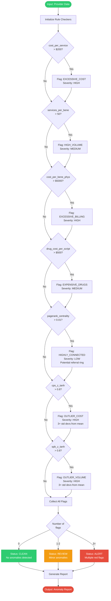

---

## 5. CI/CD Pipeline

### 5.1 Continuous Integration Workflow

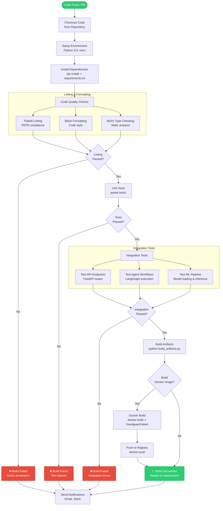

### 5.2 Continuous Deployment Workflow

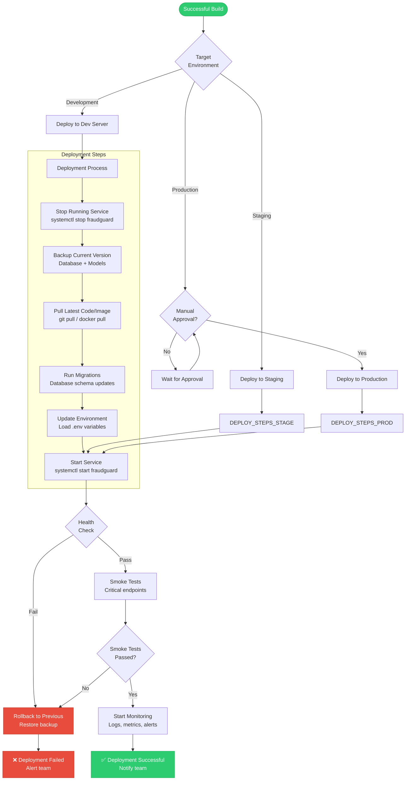

### 5.3 Model Retraining Pipeline (CI/CD for ML)

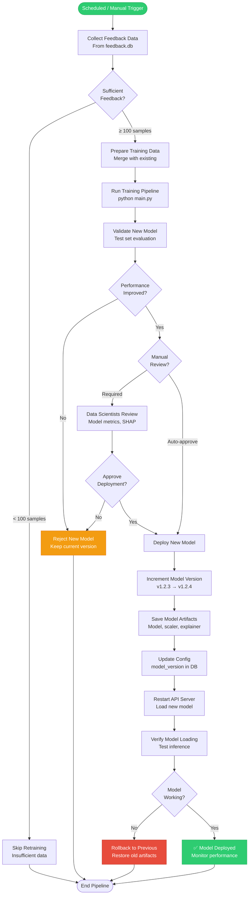

---

## 6. Deployment Workflows

### 6.1 Docker Deployment Architecture

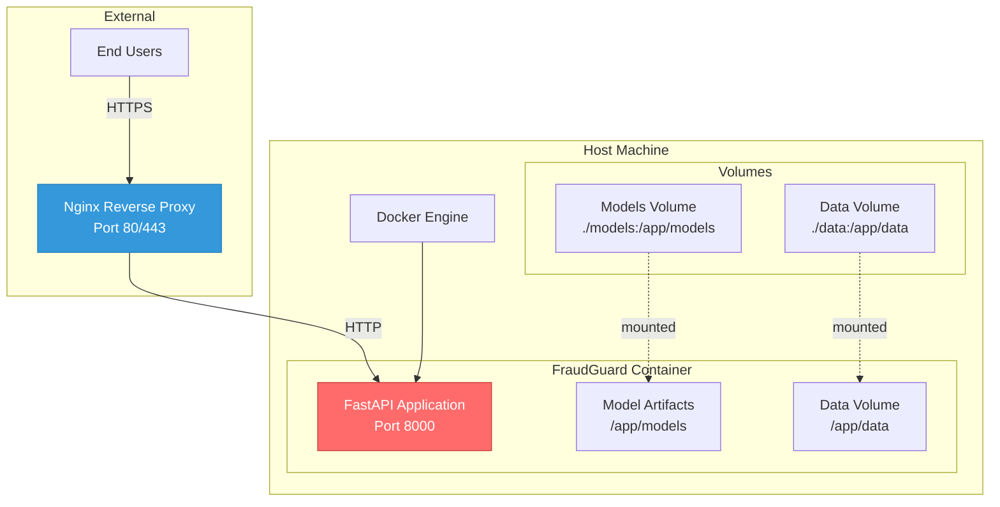

### 6.2 Production Deployment Architecture

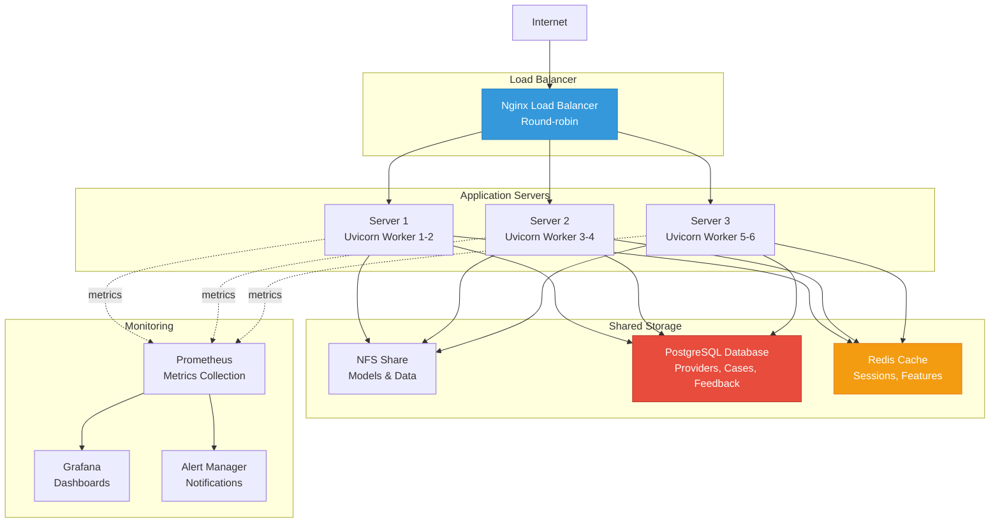

---

*Document Version: 1.0*  
*Last Updated: 2025-11-28*  
*Author: Kalyan Uppuluri*
